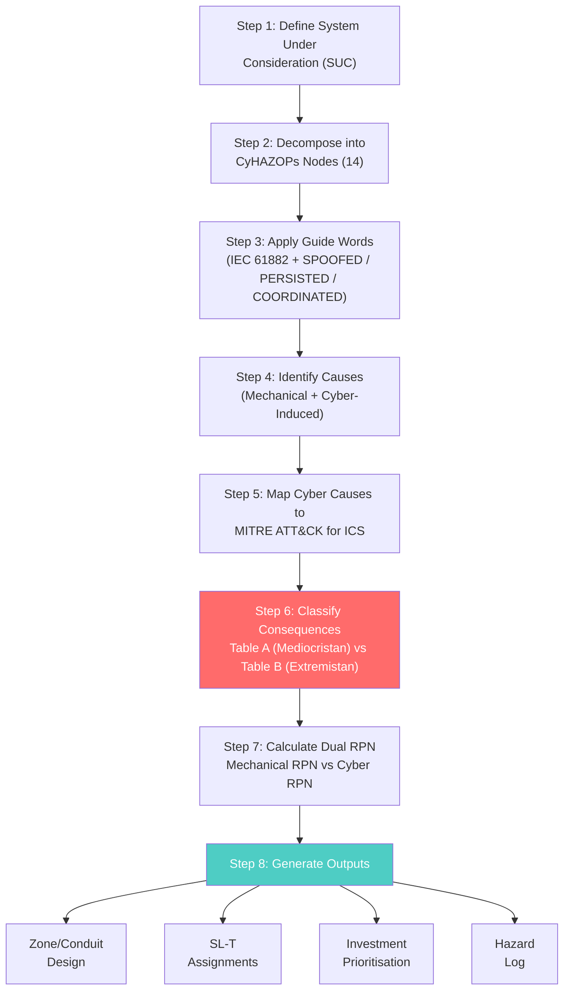

# CyHAZOPs — Cyber-Physical Hazard Analysis for Hyperscale Infrastructure

## Chapter 8: The Framework

## Abstract

CyHAZOPs (Cyber Hazard and Operability Study) is a structured workshop methodology that extends traditional HAZOP with cyber-induced deviation analysis. It produces the specific outputs required by IEC 62443-3-2 — zone/conduit models, SL-T assignments, and investment-grade risk quantification — grounded in MITRE ATT&CK for ICS threat intelligence and FMECA dual-RPN scoring. This chapter defines the methodology, its philosophical basis in Nassim Taleb's fat-tail risk theory, and its application to a 14-node hyperscale datacentre reference architecture. Chapter 9 provides the worked hazard log entries.

---

## CyHAZOPs in 60 Seconds

**What it is:** A structured workshop that identifies how cyber attacks on facility OT can cause physical damage — and what to do about it.

**What it produces:** (1) A prioritised list of every cyber-physical hazard in the facility. (2) An IEC 62443 zone/conduit design that contains each hazard. (3) An investment plan that tells the CFO exactly what to spend and why.

**How it works:** Take each facility system (cooling, power, BMS, fire). Apply structured "what if" questions: what if an attacker stops the CDU pumps? Spoofs the temperature readings? Disables the alarms? For each scenario, score the severity, map the threat to known attacker techniques (MITRE ATT&CK), and classify as routine (insurable) or catastrophic (must be architecturally eliminated).

**What makes it different from IT risk assessment:** IT risk protects data. CyHAZOPs protects equipment and people. A compromised server loses data. A compromised CDU controller destroys $50M in GPUs.

**The bottom line:** $1.60M in targeted OT controls prevents $8.88M in expected annual loss and up to $200M in maximum foreseeable single-event loss. ROSI: 842%.

---

## Foreword: Why CyHAZOPs Exists

I built CyHAZOPs because the existing tools were designed for different problems.

HAZOP was created for chemical plants in the 1960s. It identifies hazardous deviations in physical processes: too much pressure, too little flow, wrong temperature. It assumes deviations arise from mechanical failure, human error, or process upset. It does not account for an adversary who deliberately engineers a deviation while concealing it from the operator.

IT risk assessment — NIST CSF, ISO 27001 — protects data confidentiality, integrity, and availability. It treats physical consequences as externalities. A compromised server loses data. A compromised CDU controller loses a $50M GPU cluster to thermal damage.

IEC 62443 bridges these domains structurally, but it is a requirements framework, not a hazard identification methodology. It prescribes *what* to produce (zone/conduit models, SL-T assignments, gap analysis) but gives limited guidance on *how* to identify the specific threats and failure modes that should drive those assignments.

CyHAZOPs fills this gap. It combines the structured rigour of IEC 61882 HAZOP with the threat specificity of MITRE ATT&CK for ICS, the quantitative ranking of FMECA, and the investment discipline of reliability-centred maintenance. It is purpose-built for facilities where cyber and physical consequences are inseparable.

This chapter defines the methodology. Chapter 9 applies it to six high-consequence hyperscale nodes.

---

## 1. The Fat-Tail Problem: Why Conventional Risk Assessment Fails for Hyperscale OT

### 1.1 Nassim Nicholas Taleb and the Asymmetry of Consequences

My approach to cyber-physical risk is fundamentally shaped by the work of Nassim Nicholas Taleb — particularly *Fooled by Randomness* and *The Black Swan*. Taleb's central insight is that we systematically underestimate the probability and consequence of extreme events because our experience is dominated by the ordinary.

In *Fooled by Randomness*, Taleb presents a framework I have adapted for CyHAZOPs — the asymmetry between the *frequency* of an event and the *magnitude* of its consequence:

### The Two Tables of Risk

**Table A — The Left Side (Mediocristan)**

**Table 8.2: The Left Side (Mediocristan)**

| Event Type | Probability | Consequence | Expected Loss |
|:---|:---|:---|:---|
| CRAH fan bearing failure | High (1–2/year per unit) | Minor (single unit offline; N+1 covers) | Low |
| UPS battery cell degradation | High (continuous) | Minor (detected by monitoring; scheduled replacement) | Low |
| Power quality sag (utility) | Moderate (2–5/year) | Minor (UPS absorbs; no IT impact) | Low |
| BMS sensor calibration drift | Moderate (1–3/year per sensor) | Minor (gradual; detected during maintenance) | Low |

These are the events that dominate operational experience. They are frequent, well-understood, and manageable with standard maintenance practices. They belong to what Taleb calls *Mediocristan* — the domain where averages are meaningful and extreme values are bounded.

**Table B — The Right Side (Extremistan)**

**Table 8.3: The Right Side (Extremistan)**

| Event Type | Probability | Consequence | Expected Loss |
|:---|:---|:---|:---|
| Coordinated ransomware disabling BMS + CDU controllers simultaneously | Very low (but non-zero; Johnson Controls, Sep 2023) | **Catastrophic** (facility-wide thermal shutdown; $50M+ GPU damage; weeks of recovery) | **Extreme** |
| Nation-state pre-positioning in OT network for future activation | Very low (but documented; Volt Typhoon, CISA AA24-038A) | **Catastrophic** (triggered during geopolitical event; multi-facility impact; strategic infrastructure denial) | **Extreme** |
| Supply chain compromise of BMC firmware across all server vendors | Very low (but ASPEED monoculture creates single point) | **Catastrophic** (below-OS persistent implant; undetectable by endpoint security; affects all servers globally) | **Extreme** |
| Fire suppression false activation via compromised BMS-to-FAP interface | Very low | **Catastrophic** (clean agent discharge + EPO; total facility shutdown; days to re-commission) | **Extreme** |

These events are rare — so rare that they may never have occurred in a given operator's experience. But their consequences are *unbounded*. They belong to *Extremistan* — the domain where a single event can exceed the cumulative impact of all ordinary events combined.

### 1.2 The Fatal Error of Averaging

Conventional risk assessment multiplies probability × consequence to produce an "expected loss" and then ranks risks by this product. This works in Mediocristan. It fails catastrophically in Extremistan.

Consider: A CRAH fan bearing failure occurs 2× per year with a $5,000 consequence. Expected annual loss: $10,000. A coordinated OT ransomware attack occurs 0.01× per year (once per century) with a $100M consequence. Expected annual loss: $1,000,000.

The conventional risk matrix places these on the same scale and concludes that the ransomware scenario is "100× worse" than the fan bearing. But this arithmetic is meaningless because the ransomware scenario is not 100× worse — it is *qualitatively different*. The fan bearing failure is survivable, recoverable, and insurable. The coordinated OT attack may be *unrecoverable* — because the attacker can re-compromise the same systems during recovery if the architectural vulnerabilities are not addressed.

The CyHAZOPs principle: we do not average across Tables A and B. We manage them with different strategies.

Table A events (Mediocristan): managed through maintenance, monitoring, N+1 redundancy, and insurance. Standard reliability engineering.

Table B events (Extremistan): managed through architectural elimination of the conditions that enable them. Zone segmentation, firmware integrity, hardware interlocks, and defence-in-depth. The goal is not to reduce the probability of the attack — which we cannot control — but to make the attack ineffective even when it succeeds at the initial entry point.

This is the foundation of CyHAZOPs: design architectures where a breach of one zone cannot cascade to facility-wide consequence. Taleb calls this anti-fragility. In engineering terms, it is defence-in-depth with verified zone isolation.

### 1.3 Why This Matters for Hyperscale Investment Decisions

When I present to boards and procurement committees, the conversation always turns to "what is the probability of this happening?" This is the wrong question.

The right question, following Taleb, is: **"What is the consequence if it does happen, and can our architecture survive it?"**

If the answer is "a compromised CDU controller causes thermal shutdown of a 1,500-GPU training cluster, destroying $50M in hardware and delaying a $200M model training programme by 3 months" — then the probability is *irrelevant*. The architectural mitigation (network segmentation, firmware write-protection, independent thermal alarms) costs $500K–$2M. The consequence of not implementing it is existential.

CyHAZOPs provides the structured evidence and documentation to make this argument defensible, auditable, and investable.

---

## 2. CyHAZOPs Methodology

### 2.1 Definition

**CyHAZOPs** (Cyber Hazard and Operability Study) is a structured, team-based methodology for identifying cyber-physical hazards in industrial and critical infrastructure control systems. It extends traditional HAZOP (IEC 61882) with:

1. **Cyber-induced deviation causes** — deliberate manipulation via network, firmware, or supply chain attack
2. **MITRE ATT&CK for ICS technique mapping** — evidence-based threat identification
3. **FMECA quantification** — dual RPN scoring (mechanical vs. cyber-induced)
4. **IEC 62443 integration** — direct output to zone/conduit design and SL-T assignment
5. **Fat-tail consequence assessment** — explicit identification of Extremistan scenarios

### 2.2 Inputs Required

**Table 8.4: Inputs Required for CyHAZOPs Workshop**

| Input | Source | Purpose | Example CVEs / Advisories |
|:---|:---|:---|:---|
| High-Level Design (HLD) | Facility engineering team | Define system boundaries and design intent | — |
| P&ID drawings | MEP engineering | Identify instrumentation, control loops, and OT components | — |
| BMS/EPMS architecture | Controls engineering | Map supervisory control and data acquisition paths | Honeywell Niagara CVE-2025-3936 (CVSS 9.8) [NVD, 2025]; Johnson Controls Metasys CVE-2025-26385 (CVSS 10.0) [CISA ICSA-26-027-04, 2026] |
| OT network topology | Network engineering | Identify conduit boundaries and segmentation gaps | Moxa EDR-810 CVE-2024-9138 (hard-coded credentials) [MPSA-241155, 2025] |
| Vendor product datasheets | Procurement | Identify OT interfaces, protocols, and firmware versions | APC Smart-UPS TLStorm CVE-2022-22805 (CVSS 9.8) [NVD, 2022]; Eaton Network-M2 CVE-2025-22495 (command injection) [Eaton Advisory, 2025] |
| IEC 62443-4-2 certification status | Vendor / ISASecure registry | Determine SL-A for installed components | Moxa EDR-G9010 CSA certified [ISASecure, 2025]; most datacenter OT products not certified (see Section 2.5) |
| MITRE ATT&CK for ICS knowledge base | MITRE | Map known adversary TTPs to system components | T0830 (Adversary-in-the-Middle) for BACnet/Modbus; T0878 (Alarm Suppression) for BMS [MITRE, 2025] |
| Threat intelligence | CISA ICS-CERT, Dragos WorldView, vendor advisories | Identify active threats to specific products | Dark Angels ransomware on Johnson Controls (Sep 2023) [JCI Trust Center, 2025]; Volt Typhoon OT targeting [CISA AA24-038A, 2024] |
| Incident history | Facility operations | Identify known failure modes and near-misses | — |

### 2.3 The CyHAZOPs Process — Eight Steps

### Figure 4 — CyHAZOPs Eight-Step Process Flow



### 2.4 Guide Words — Extended for Cyber-Physical Analysis

CyHAZOPs uses the standard IEC 61882 guide words with three cyber-specific additions:

**Table 8.5: CyHAZOPs Guide Words**

| Guide Word | Meaning | Cyber-Specific Extension | Example Cyber Deviation |
|:---|:---|:---|:---|
| NO / NOT | No flow or no signal | Denial of Service (DoS) on sensor/actuator | Attacker floods BACnet controller with garbage packets, halting all HVAC commands |
| MORE | Higher value than intended | Setpoint manipulation (increase) | Attacker raises CDU supply temperature setpoint to 35°C via compromised BMS |
| LESS | Lower value than intended | Setpoint manipulation (decrease) | Attacker lowers chiller setpoint to 4°C, causing freeze damage |
| REVERSE | Opposite direction or logic | Logic inversion in control program | Attacker flips pump start/stop bit, causing reverse flow |
| PART OF | Only part of the intended function | Partial disablement of safety interlocks | Attacker disables high-temperature alarm while leaving cooling active |
| OTHER THAN | Different function than intended | Unauthorized command injection | Attacker sends "emergency stop" command to UPS via exposed API |
| **SPOOFED** | Sensor or actuator data falsified | Adversary-in-the-Middle (AitM) on fieldbus | Attacker intercepts and modifies temperature readings to mask overheating |
| **PERSISTED** | Malicious code survives reboot or firmware update | Firmware backdoor or bootkit | Attacker installs persistent implant on UPS NMC via TLStorm-style firmware signing bypass |
| **COORDINATED** | Multiple simultaneous deviations across systems | Multi-vector attack | Attacker simultaneously disables cooling and suppresses alarms across multiple BMS zones |

### 2.5 Vulnerability Reference Data for CyHAZOPs Nodes

This section provides specific CVE data and standards references for each major OT subsystem in a hyperscale datacenter. Use these tables during Step 4 (Identify Causes) and Step 5 (Map to MITRE ATT&CK) of the CyHAZOPs process.

#### 2.5.1 BMS Platforms

| Vendor | Product | CVE ID | CVSS | Date | ATT&CK Technique | Datacenter Relevance |
|:---|:---|:---|:---|:---|:---|:---|
| Honeywell | Niagara Framework / JACE | CVE-2025-3936 | 9.8 | Jul 2025 | T0859 (Valid Accounts) | BMS controller compromise allows setpoint manipulation and alarm suppression |
| Honeywell | Niagara Framework | CVE-2025-3937 | 9.8 | Jul 2025 | T0812 (Default Credentials) | Default credentials on JACE controllers enable full BMS takeover |
| Honeywell | Niagara Framework | CVE-2025-3944 | 9.8 | Jul 2025 | T0859 (Valid Accounts) | Authentication bypass in Niagara web interface |
| Johnson Controls | Metasys ADS/ADX | CVE-2025-26385 | **10.0** | Jan 2026 | T0871 (Execution through API) | SQL injection allows remote command execution on BMS server; affects chiller and HVAC control |
| Siemens | Desigo CC | CVE-2025-47809 | 8.2 | 2025 | T0859 (Valid Accounts) | Privilege escalation via CodeMeter license import; unprivileged user gains admin |
| Siemens | Desigo CC | CVE-2024-23815 | 7.5 | 2024 | T0871 (Execution through API) | Unauthenticated SQL queries on event port 4998/tcp |
| Schneider Electric | EcoStruxure Building Operation | CVE-2026-1226 | High | Feb 2026 | T0871 (Execution through API) | XXE injection in EBO Workstation/WebStation |

**Sources:** [NVD, 2025]; [CISA ICSA-26-027-04, 2026]; [Siemens ProductCERT, 2025]; [Schneider SEVD-2026-041-02, 2026]

#### 2.5.2 Power Infrastructure

| Vendor | Product | CVE ID | CVSS | Date | ATT&CK Technique | Datacenter Relevance |
|:---|:---|:---|:---|:---|:---|:---|
| Schneider Electric | APC Smart-UPS (TLStorm) | CVE-2022-22805 | 9.8 | Mar 2022 | T0866 (Exploitation of Remote Services) | TLS bypass allows remote firmware manipulation; millions of units still unpatched |
| Schneider Electric | APC Smart-UPS (TLStorm) | CVE-2022-22806 | 9.8 | Mar 2022 | T0830 (Adversary-in-the-Middle) | MiTM on UPS management traffic |
| Eaton | UPS Companion (EUC) | CVE-2025-59887 | 8.6 | Dec 2025 | T0866 (Exploitation of Remote Services) | DLL hijacking in installer → arbitrary code execution on UPS management workstation |
| Eaton | Network-M2 Card | CVE-2025-22495 | 8.4 | Feb 2025 | T0871 (Execution through API) | NTP config field command injection; card is EOL — migrate to Network-M3 |
| Vertiv | UPS Management Cards | CVE-2025-46412 | Critical | 2025 | T0859 (Valid Accounts) | Authentication bypass on Vertiv UPS webserver |
| Vertiv | UPS Management Cards | CVE-2025-41426 | Critical | 2025 | T0866 (Exploitation of Remote Services) | Stack-based buffer overflow → code execution on UPS management cards |
| ASCO / Schneider | ATS Remote Annunciator 5310/5350 | CVE-2025-1058 | 8.7 | Apr 2025 | T0857 (System Firmware) | Code download without integrity check; ATS status manipulation |
| ASCO / Schneider | ATS Remote Annunciator 5310/5350 | CVE-2025-1060 | High | Apr 2025 | T0882 (Theft of Operational Info) | Cleartext transmission of sensitive information |

**Sources:** [NVD, 2022]; [Eaton ETN-VA-2025-1026, 2025]; [Vertiv Security Center, 2025]; [CISA Advisory, Apr 2025]

#### 2.5.3 Cooling Infrastructure

| Vendor | Product | CVE ID | CVSS | Date | ATT&CK Technique | Datacenter Relevance |
|:---|:---|:---|:---|:---|:---|:---|
| ABB | Drive Composer | CVE-2024-48510 | 9.8 | 2024 | T0882 (Theft of Operational Info) | Path traversal in VFD configuration software; attacker can read/write drive parameters |
| ABB | AC500 V3 PLC | CVE-2025-2595 | High | 2025 | T0859 (Valid Accounts) | Authentication bypass on PLC controlling cooling pumps |
| Siemens | SINAMICS S200 VFD | CVE-2024-56336 | 9.8 | Mar 2025 | T0857 (System Firmware) | Unlocked bootloader allows full device compromise; VFD controls cooling fans/pumps |
| Siemens | SINAMICS Startdrive | CVE-2024-54678 | 8.2 | 2024 | T0871 (Execution through API) | Deserialization of untrusted data → local code execution on VFD engineering software |
| Danfoss | VLT VFD series | None critical | — | — | — | IEC 62443-4-2 SL1 certified; no critical CVEs on core drive firmware [Danfoss, 2025] |

**Sources:** [ABB PSIRT, 2024]; [Siemens ProductCERT, 2025]; [Danfoss Security Advisory, 2025]

#### 2.5.4 Physical Security Systems

| Vendor | Product | CVE ID | CVSS | Date | ATT&CK Technique | Datacenter Relevance |
|:---|:---|:---|:---|:---|:---|:---|
| Genetec | Security Center ALPR Manager | CVE-2025-43027 | Critical | 2025 | T0859 (Valid Accounts) | Improper access control → administrative takeover of video surveillance |
| Axis | Camera Station Pro (Axis.Remoting) | CVE-2025-30023 | 9.0 | 2025 | T0866 (Exploitation of Remote Services) | RCE via Axis.Remoting protocol; camera compromise enables physical reconnaissance |
| Axis | VAPIX Device Configuration | CVE-2025-0324 | 9.4 | 2025 | T0859 (Valid Accounts) | Privilege escalation in VAPIX framework; full camera control |
| HID / Mercury | Intelligent Controllers | CVE-2022-31481 | 10.0 | Jun 2022 | T0866 (Exploitation of Remote Services) | Buffer overflow in access control panel; many field deployments unpatched |
| HID / Mercury | Intelligent Controllers | CVE-2022-31479 | 9.8 | Jun 2022 | T0871 (Execution through API) | Command injection in access control panel |

**Sources:** [Genetec TechDoc, 2025]; [Axis Trust Center, 2025]; [CISA Advisory, Jun 2022]

#### 2.5.5 DCIM / OT Monitoring

| Vendor | Product | CVE ID | CVSS | Date | ATT&CK Technique | Datacenter Relevance |
|:---|:---|:---|:---|:---|:---|:---|
| Schneider Electric | EcoStruxure IT Data Center Expert | CVE-2025-50121 | Critical | Jul 2025 | T0871 (Execution through API) | OS command injection in DCIM platform; attacker gains full control of monitoring |
| Schneider Electric | EcoStruxure IT Data Center Expert | CVE-2025-50122 | Critical | Jul 2025 | T0859 (Valid Accounts) | Insufficient entropy → root password discovery |
| Schneider Electric | EcoStruxure IT Data Center Expert | CVE-2025-50123 | Critical | Jul 2025 | T0866 (Exploitation of Remote Services) | RCE in DCIM; can manipulate power/cooling telemetry |
| Schneider Electric | Power Monitoring Expert (PME) | CVE-2025-54923 | High | 2025 | T0866 (Exploitation of Remote Services) | Deserialization of untrusted data in power monitoring system |
| Schneider Electric | Power Monitoring Expert (PME) | CVE-2025-54924 | High | 2025 | T0882 (Theft of Operational Info) | SSRF in PME; attacker can exfiltrate power telemetry |

**Sources:** [Schneider SEVD, Jul 2025]; [Schneider SEVD-2025-224-02, 2025]

#### 2.5.6 Industrial Network Equipment

| Vendor | Product | CVE ID | CVSS | Date | ATT&CK Technique | Datacenter Relevance |
|:---|:---|:---|:---|:---|:---|:---|
| Moxa | EDR-810/8010, EDR-G902/G9004 | CVE-2024-9138 | 8.6 | Jan 2025 | T0812 (Default Credentials) | Hard-coded credentials → root-level access on OT network switches |
| Moxa | EDR-810/8010, EDR-G902/G9004 | CVE-2024-9140 | Critical | Jan 2025 | T0871 (Execution through API) | Command injection in same product family |
| Cisco | Catalyst IE3400 (IOS XE) | Various | Various | 2024–2025 | T0866 (Exploitation of Remote Services) | IE3000 series EOL Sep 2024; IE3400 inherits IOS XE vulnerabilities |

**Sources:** [Moxa MPSA-241155, 2025]; [Cisco Security Advisories, 2024]

#### 2.5.7 Protocol-Level Vulnerabilities

| Protocol | Vulnerability | Risk Level | ATT&CK Technique | Mitigation |
|:---|:---|:---|:---|:---|
| BACnet/IP | No authentication, no encryption | Critical | T0830 (Adversary-in-the-Middle) | Deploy BACnet/SC with TLS; use protocol-aware firewalls |
| Modbus TCP | No authentication, no encryption | Critical | T0830 (Adversary-in-the-Middle) | Tunnel over VPN or use Modbus/TCP security gateway |
| BACnet/IP | Broadcast device discovery (Who-Is) | Medium | T0802 (Automated Collection) | Restrict broadcast domains; use BACnet/SC |
| Both | Default device passwords | High | T0812 (Default Credentials) | Enforce credential change at commissioning |

**Sources:** [BACnet International, 2025]; [Modbus Organization, 2025]

### 2.6 Standards Integration

CyHAZOPs outputs map directly to the following standards. Use this table during Step 8 (Generate Outputs) to ensure compliance.

**Table 8.6: Standards Mapping for CyHAZOPs Outputs**

| CyHAZOPs Output | Applicable Standard | Specific Clause | Datacenter Application |
|:---|:---|:---|:---|
| Zone/Conduit Design | IEC 62443-3-2 | ZCR 1–5 (Zone & Conduit Requirements) | Partition BMS, EPMS, fire/life safety, physical security into zones; assign SL-T per zone |
| SL-T Assignments | IEC 62443-3-2 | Clause 5 (Security Level Definitions) | SL 2 for BMS field devices; SL 3 for EPMS/UPS/CDU; SL 3–4 for substation protection relays |
| Component Security Requirements | IEC 62443-4-2 | FR 1–7 (Foundational Requirements) | Require CSA certification for all OT components; verify FR 3 (System Integrity) for firmware |
| Secure Development Lifecycle | IEC 62443-4-1 | SDLA process | Vendor SDLA certification (ML3) required for procurement |
| Thermal Hazard Mitigation | ASHRAE TC 9.9 | Thermal Guidelines (2021) | Ensure cooling redundancy and independent thermal alarms per ASHRAE Class A1–A4 |
| Fire Protection | NFPA 75 (Datacenter) | Section 8 (Fire Alarm) | Hardwired interlocks between BMS and fire alarm panel; no network-dependent EPO |
| Fire Protection | NFPA 76 (Telecom) | Section 5 (Suppression) | Clean agent systems with mechanical backup release |
| Battery Energy Storage | NFPA 855 / UL 9540A | Section 4 (BESS) | Thermal runaway detection; BMS (battery) must be isolated from OT network |
| Datacenter Classification | EN 50600 / ISO 22237 | Availability classes (1–4) | CyHAZOPs hazard log informs required availability class |
| Substation Automation | IEC 61850 | GOOSE/MMS security | Dedicated fiber for protection relays; no IP routing to enterprise |
| Firmware Security | OCP S.A.F.E. | Secure Firmware Framework | Require signed firmware, measured boot, and secure update for all OT devices |

**Sources:** [IEC 62443-3-2, 2020]; [IEC 62443-4-2, 2019]; [ASHRAE TC 9.9, 2021]; [NFPA 75, 2020]; [NFPA 76, 2020]; [NFPA 855, 2023]; [EN 50600, 2019]; [ISO 22237, 2020]; [IEC 61850, 2022]; [OCP S.A.F.E., 2024]

### 2.7 MITRE ATT&CK for ICS Mapping for Datacenter OT

The following table maps the most relevant ATT&CK for ICS techniques to datacenter OT subsystems. Use this during Step 5 of the CyHAZOPs process.

**Table 8.7: MITRE ATT&CK for ICS Techniques — Datacenter OT Relevance**

| Technique ID | Technique Name | Datacenter OT Subsystem | Example Scenario |
|:---|:---|:---|:---|
| T0830 | Adversary-in-the-Middle | BMS, EPMS, Cooling | Intercept BACnet traffic to spoof temperature readings |
| T0802 | Automated Collection | BMS, EPMS | BACnet device enumeration to map cooling/power topology |
| T0878 | Alarm Suppression | BMS, Fire/Life Safety | Mask high-temperature alarms while manipulating cooling |
| T0800 | Activate Firmware Update Mode | UPS NMCs, VFDs | Halt monitoring on critical cooling/power devices |
| T0883 | Internet Accessible Device | BMS, DCIM | Exposed BMS controller with default credentials |
| T0812 | Default Credentials | All OT devices | Moxa hard-coded creds; APC default "apc" password |
| T0859 | Valid Accounts | BMS, DCIM, EPMS | Compromised operator credentials for BMS/DCIM access |
| T0866 | Exploitation of Remote Services | UPS NMCs, DCIM, Cameras | RCE on APC TLStorm, EcoStruxure IT DCE, Axis cameras |
| T0871 | Execution through API | BMS, DCIM | SQL injection on Metasys; API abuse on EcoStruxure |
| T0857 | System Firmware | UPS, ATS, VFDs | ASCO firmware integrity bypass; APC TLStorm firmware signing |
| T0839 | Module Firmware | Protection Relays, VFDs | SIPROTEC development shell; SEL undocumented features |
| T0882 | Theft of Operational Information | EPMS, DCIM | Power/cooling telemetry exfiltration for reconnaissance |
| T0814 | Denial of Service | UPS, BMS, Relays | UPS DoS; BMS resource exhaustion; relay file transfer DoS |
| T0831 | Manipulation of Control | Cooling, Power | Changing temperature setpoints; disabling cooling; power transfer manipulation |

**Source:** [MITRE ATT&CK for ICS, 2025]

### 2.8 ISASecure Certified Products Gap Analysis

During procurement, verify that OT components carry ISASecure CSA certification per IEC 62443-4-2. The following table identifies certified products and critical gaps.

**Table 8.8: ISASecure Certification Status for Datacenter OT Products**

| Asset Type | Typical Vendors | ISASecure CSA Status | Recommendation |
|:---|:---|:---|:---|
| Industrial Router/Firewall | Moxa EDR-G9010 | **Certified** | Acceptable for zone boundary conduits |
| Industrial Managed Switch | Moxa TN-4900 | **Certified** | Acceptable for OT network backbone |
| BMS Controller | Honeywell ControlEdge PLC | **Certified** | Acceptable for BMS zone |
| BMS Controller | Schneider EBO, Siemens Desigo CC, JCI Metasys | **Not certified** (vendor SDLA only) | Require vendor roadmap for CSA; implement compensating controls |
| UPS Network Management Card | Vertiv Liebert, Schneider APC, Eaton | **Not certified** | Critical gap; enforce firmware integrity and network segmentation |
| CDU/Coolant Distribution PLC | Vertiv, Motivair, CoolIT | **Not certified** | Require vendor to pursue CSA; use hardware interlocks |
| EPMS Meter | Schneider ION series | **Not certified** | Implement read-only data diode for telemetry |
| Protection Relay | SEL, ABB, Siemens | **Not ISASecure** (IEC 61850 focused) | Accept if IEC 61850 certified; require firmware signing |
| VFD (Chiller/Pump) | ABB, Siemens, Danfoss | **Not certified** (Danfoss VLT has SL1) | Danfoss VLT acceptable; others require compensating controls |
| Fire Alarm Control Panel | Honeywell, Siemens, Edwards | **Not certified** (vendor SDLA only) | Hardwired interlocks mandatory; network path via industrial firewall |

**Source:** [ISASecure Certified Products Registry, 2025]

---

## 3. CyHAZOPs Node Decomposition for Hyperscale Reference Architecture

The 14-node decomposition is defined in Chapter 9. Each node corresponds to a specific OT subsystem. The vulnerability data in Section 2.5 provides the cyber-induced failure modes for each node. The standards mapping in Section 2.6 provides the compliance requirements for each node's zone/conduit design.

---

## 4. Outputs and Deliverables

### 4.1 Zone/Conduit Design

The CyHAZOPs workshop produces a zone/conduit model per IEC 62443-3-2. The recommended zone model for a hyperscale datacenter is shown in Figure 8.2.

**Figure 8.2: Recommended Datacenter OT Zone Model**

```
┌─────────────────────────────────────────────────────────┐
│                   ZONE 0: Enterprise IT                  │
│   (DCIM dashboards, IT management, corporate network)    │
│                        SL-T: 2                           │
└──────────────┬──────────────────────────┬────────────────┘
               │ Conduit C0-1             │ Conduit C0-2
               │ (Data Diode / DMZ)       │ (Firewall)
┌──────────────▼──────────────┐ ┌─────────▼────────────────┐
│   ZONE 1: BMS / HVAC        │ │  ZONE 2: Electrical       │
│   Chillers, AHUs, CRAHs,    │ │  EPMS, UPS, STS, PDUs,    │
│   CDUs, pumps, VFDs          │ │  Generators, ATS           │
│   SL-T: 2–3                 │ │  SL-T: 3                   │
└──────────────┬──────────────┘ └─────────┬────────────────┘
               │ Conduit C1-3             │ Conduit C2-4
               │                          │
┌──────────────▼──────────────┐ ┌─────────▼────────────────┐
│   ZONE 3: Fire & Life Safety│ │  ZONE 4: Substation /     │
│   FACP, suppression, VESDA, │ │  Grid Interconnect        │
│   gas detection              │ │  Protection relays, IEDs, │
│   SL-T: 3                   │ │  SCADA gateway             │
│                              │ │  SL-T: 3–4                │
└──────────────────────────────┘ └──────────────────────────┘

┌──────────────────────────────┐ ┌──────────────────────────┐
│   ZONE 5: Physical Security  │ │  ZONE 6: BESS / Battery   │
│   Access control, CCTV,      │ │  BMS (battery), inverters, │
│   intrusion detection        │ │  thermal management        │
│   SL-T: 2–3                 │ │  SL-T: 3                   │
└──────────────────────────────┘ └──────────────────────────┘
```

**Conduit Security Controls:**

| Conduit | From → To | Protocol | Security Control | Standard Reference |
|:---|:---|:---|:---|:---|
| C0-1 | Enterprise IT → BMS | BACnet/IP, Modbus TCP | Industrial firewall + DPI; unidirectional gateway preferred | IEC 62443-3-2 ZCR 5 |
| C0-2 | Enterprise IT → Electrical | DNP3, IEC 61850 MMS | Data diode for telemetry; separate command path with MFA | IEC 62443-3-2 ZCR 5 |
| C1-3 | BMS → Fire/Life Safety | Proprietary, BACnet | Hardwired interlocks preferred; network path via industrial FW | NFPA 75 Section 8 |
| C2-4 | Electrical → Substation | IEC 61850 GOOSE/MMS | Dedicated fiber; PRP/HSR redundancy; no IP routing to Zone 0 | IEC 61850-90-4 |
| C5-0 | Physical Security → Enterprise | ONVIF, OSDP | Isolated VLAN; encrypted tunnel to SOC/GSOC | IEC 62443-3-2 ZCR 5 |

### 4.2 SL-T Assignments

Security Level Targets (SL-T) are assigned per zone based on the CyHAZOPs consequence assessment. The following table provides recommended SL-T values for each zone in a hyperscale datacenter.

**Table 8.9: Recommended SL-T Assignments per Zone**

| Zone | SL-T | Rationale | Key FRs to Enforce |
|:---|:---|:---|:---|
| Z1: BMS/HVAC | 2–3 | BMS compromise can cause thermal damage; SL 3 for CDU controls, SL 2 for non-critical sensors | FR 3 (System Integrity), FR 5 (Restricted Data Flow) |
| Z2: Electrical | 3 | UPS/EPMS compromise can cause total power loss; SL 3 minimum | FR 1 (IAC), FR 7 (Resource Availability) |
| Z3: Fire/Life Safety | 3 | False activation or suppression can cause facility shutdown; SL 3 | FR 3 (System Integrity), FR 5 (Restricted Data Flow) |
| Z4: Substation | 3–4 | Grid interconnect compromise can cause cascading outage; SL 4 for protection relays | FR 1 (IAC), FR 3 (System Integrity), FR 7 (RA) |
| Z5: Physical Security | 2–3 | Access control compromise enables physical intrusion; SL 3 for door controllers | FR 1 (IAC), FR 2 (Use Control) |
| Z6: BESS | 3 | Battery thermal runaway risk; SL 3 for battery management system | FR 3 (System Integrity), FR 7 (RA) |

### 4.3 Investment Prioritisation

The dual-RPN scoring (mechanical RPN vs. cyber RPN) from Step 7 drives investment prioritisation. Scenarios with high cyber RPN and Extremistan classification receive highest priority for architectural mitigation. Chapter 9 provides worked examples.

---

## 5. Conclusion

CyHAZOPs provides the structured methodology needed to identify, quantify, and mitigate cyber-physical hazards in hyperscale datacenters. By integrating IEC 61882 HAZOP, MITRE ATT&CK for ICS, FMECA, and IEC 62443, it bridges the gap between IT risk assessment and physical safety engineering. The vulnerability data in Section 2.5 and standards mapping in Section 2.6 ensure that the methodology is grounded in real-world threat intelligence and regulatory requirements.

The next chapter applies CyHAZOPs to six high-consequence nodes in the reference architecture, producing complete hazard log entries with dual-RPN scores and recommended mitigations.

---

## References

1. IEC 61882:2016 — Hazard and operability studies (HAZOP studies) — Application guide
2. IEC 62443-3-2:2020 — Security risk assessment for system design
3. IEC 62443-4-2:2019 — Technical security requirements for IACS components
4. IEC 62443-4-1:2018 — Secure product development lifecycle requirements
5. MITRE ATT&CK for ICS, Version 14, 2025
6. ASHRAE TC 9.9, Thermal Guidelines for Data Processing Environments, 5th Edition, 2021
7. NFPA 75:2020 — Standard for the Fire Protection of Information Technology Equipment
8. NFPA 76:2020 — Standard for the Fire Protection of Telecommunications Facilities
9. NFPA 855:2023 — Standard for the Installation of Stationary Energy Storage Systems
10. EN 50600-2-1:2019 — Information technology — Data centre facilities and infrastructures
11. ISO 22237-1:2020 — Information technology — Data centre facilities and infrastructures
12. IEC 61850-90-4:2020 — Network engineering guidelines for substation automation
13. OCP S.A.F.E. (Security, Audit, Firmware, and Encryption) Framework, 2024
14. CISA ICS-CERT Advisories: ICSA-26-027-04, ICSA-25-322-04, ICSA-25-219-02
15. NVD CVEs: CVE-2025-26385, CVE-2025-3936, CVE-2022-22805, CVE-2025-59887, CVE-2025-50121
16. ISASecure Certified Products Registry, 2025. https://isasecure.org/certification/certified-products
17. Johnson Controls Trust Center, 2025. Dark Angels ransomware incident disclosure.
18. CISA AA24-038A, 2024. Volt Typhoon targeting critical infrastructure.
19. Taleb, N.N. (2001). Fooled by Randomness. Random House.
20. Taleb, N.N. (2007). The Black Swan. Random House.