# Design Considerations for Hyperscale Datacentre Infrastructure

## Chapter 16: Concept of Operations and Minimum Operating Requirements

## Abstract

A reference architecture without a Concept of Operations (ConOps) is a drawing without instructions. This chapter defines *how* the hyperscale facility operates across its seven operational modes — from Normal Operations through Graceful Degradation to Emergency Shutdown — and maps the OT cybersecurity posture required in each, referencing IEC 62443-3-2 zone/conduit security level targets (SL-T) [IEC 62443-3-2, Clause 5]. It then establishes the Minimum Operating Requirements (MoR): the irreducible set of systems, functions, and conditions below which the facility cannot operate safely. The MoR is the foundation upon which Critical Items Lists (Chapter 17) are built and the threshold at which automatic protective actions must engage. The MoR concept is derived from nuclear safety principles (e.g., 10 CFR 50.65, Maintenance Rule) and petrochemical process safety (IEC 61511), adapted for datacenter OT.

---

## Practitioner's Note

Every facility I have assessed has a ConOps document for its mechanical and electrical systems. None has a ConOps that incorporates cybersecurity. The operator knows that if two of three chillers fail, the facility enters degraded mode and begins shedding IT load. But no one has defined what happens if the BMS controller that *manages* those chillers is compromised. The mechanical failure mode is documented. The cyber failure mode is not.

The MoR concept is borrowed from nuclear and petrochemical operations, where regulators require operators to define the minimum set of safety systems that must be functional before the plant can operate. A nuclear reactor cannot go critical if a single Emergency Core Cooling System pump is out of service. The MoR for a hyperscale facility should impose the same discipline: if the fire alarm system's OT network is compromised, the facility is *below MoR* and must initiate a controlled response — not continue operating and hope for the best.

This chapter formalises that discipline for the hyperscale reference architecture, integrating standards from IEC 62443, ASHRAE TC 9.9, NFPA 75/76/855, EN 50600, and IEC 61850.

---

## 1. Concept of Operations — Seven Operational Modes

### 1.1 Mode Definition Table

**Table 16.2: 1.1 Mode Definition Table**

| Mode | ID | Description | OT Security Posture | IEC 62443 SL-T (Zone) | Trigger |
|:---|:---|:---|:---|:---|:---|
| **Normal Operations** | M1 | All systems operating within design parameters; N+1 redundancy maintained | Standard monitoring; passive IDS; scheduled patching | SL 2 (BMS Zone 1), SL 3 (Electrical Zone 2) | Default state |
| **Planned Maintenance** | M2 | One or more OT systems taken offline for scheduled maintenance; reduced redundancy | Heightened monitoring on remaining systems; change freeze on non-maintenance OT | SL 2–3 (affected zone) | Scheduled window |
| **Degraded — Mechanical** | M3 | Mechanical failure (chiller, pump, ATS) reduces capacity below N+1 but above MoR | Accelerated polling on affected node; IDS alert threshold lowered; manual override authorised | SL 2 (mechanical zone) | Equipment failure detection |
| **Degraded — Cyber** | M4 | Confirmed or suspected cyber compromise of one or more OT nodes; systems remain functional | Incident response activation; affected node isolated; manual control assumed; forensic capture initiated | SL 3 (cyber incident zone) | IDS alert; SOC confirmation |
| **Graceful Degradation** | M5 | Facility capacity reduced intentionally to maintain safety margin; IT load shedding underway | Maximum OT vigilance; all non-essential OT access revoked; read-only mode on DCIM | SL 3 (all zones) | Capacity threshold breach (thermal or electrical) |
| **Emergency Operations** | M6 | Life safety event (fire, thermal runaway, seismic, flood); EPO may be activated | All OT secondary to life safety systems; BMS-to-Fire hardwired path takes priority; manual operations only | SL 3 (Fire Zone 3) | Life safety system activation |
| **Emergency Shutdown** | M7 | Full facility shutdown; all IT load dropped; cooling maintained for thermal rundown | Post-shutdown forensic preservation; no OT changes; evidence chain initiated | SL 4 (if substation involved) | Catastrophic event; EPO activation |

### 1.2 Mode Transition Diagram

```mermaid {caption="Figure 16.1: 1.2 Mode Transition Diagram"}
stateDiagram-v2
    M1: Normal Operations
    M2: Planned Maintenance
    M3: Degraded (Mechanical)
    M4: Degraded (Cyber)
    M5: Graceful Degradation
    M6: Emergency Operations
    M7: Emergency Shutdown

    M1 --> M2: Maintenance window opens
    M2 --> M1: Maintenance complete; N+1 restored
    M1 --> M3: Equipment failure detected
    M3 --> M1: Repair complete; N+1 restored
    M1 --> M4: Cyber incident confirmed
    M4 --> M1: Incident resolved; node restored
    M3 --> M5: Capacity below threshold
    M4 --> M5: Compromise affects capacity
    M5 --> M1: Load shed complete; capacity restored
    M5 --> M6: Life safety event during degradation
    M1 --> M6: Life safety event
    M3 --> M6: Mechanical failure triggers safety event
    M6 --> M7: Catastrophic escalation; EPO
    M7 --> M1: Full restart procedure (documented separately)
    M4 --> M6: Cyber attack triggers physical consequence
```



### 1.3 Cyber-Specific Mode Transitions

The critical insight: **Mode M4 (Degraded — Cyber) can transition to M5 or M6 without any mechanical failure.** A successful cyber attack on cooling controls can produce the same thermal emergency as a chiller failure. The ConOps must recognise that cyber events are *initiating events* for mechanical mode transitions, not merely IT incidents.

**Table 16.3: Cyber Event - Resulting Mode Transition**

| Cyber Event | Resulting Mode Transition | Time to Physical Consequence | Verified CVEs (Example) |
|:---|:---|:---|:---|
| BMS controller compromise (single) | M1 → M4 | No immediate physical impact; monitoring gap | CVE-2023-1234 (Schneider BMS controller) |
| CDU controller manipulation (setpoint change) | M1 → M4 → M5 | 45 seconds to GPU thermal throttling (DLC); 3–8 minutes to air-cooled equipment | CVE-2022-4567 (CoolIT CDU) |
| Coordinated UPS NMC attack (all blocks) | M1 → M4 → M6 | 10–15 seconds (stored energy duration) | CVE-2021-3456 (APC UPS NMC) |
| Fire alarm suppression + thermal manipulation | M1 → M4 → M6 → M7 | Minutes (undetected thermal event escalates) | CVE-2020-7890 (Honeywell FACP) |
| BESS BMS manipulation (thermal runaway initiation) | M1 → M4 → M6 → M7 | 1–60 seconds per cell (DNV, 2020); minutes to module propagation | CVE-2023-5678 (Tesla BESS BMS) |

**Note:** CVE identifiers are illustrative; actual CVEs should be verified against current NVD data at time of deployment.

---

## 2. Minimum Operating Requirements (MoR)

### 2.1 Definition

The Minimum Operating Requirements define the irreducible set of systems, functions, and conditions that must be operational for the facility to remain in Normal Operations (M1) or Planned Maintenance (M2). If any MoR item becomes unavailable, the facility must transition to the appropriate degraded mode and initiate the corresponding response procedure.

### 2.2 MoR Principles

1. **MoR is not N+1.** MoR is the minimum acceptable condition, not the design condition. A facility designed with N+1 chiller redundancy has an MoR of N chillers — the +1 can be offline without violating MoR.
2. **MoR includes OT.** A functioning chiller without a functioning control system is not a functioning chiller. The MoR must include the OT components that make the mechanical equipment controllable.
3. **MoR is mode-dependent.** A system required in M1 (Normal) may not be required in M5 (Graceful Degradation), because the facility has already begun shedding load and accepting reduced capacity.
4. **MoR violations require action.** An MoR violation is not a monitoring alarm — it is a mandatory response trigger. The response is defined in the ConOps mode transition rules.

### 2.3 MoR Register — Power Systems

**Table 16.4: 2.3 MoR Register — Power Systems**

| MoR ID | System | Minimum Requirement for M1 | MoR OT Requirement | IEC 61850 / Vendor Reference | Violation Response |
|:---|:---|:---|:---|:---|:---|
| MoR-P01 | Utility feed | At least 1 of 2 independent feeds energised | EPMS monitoring of both feeds; protective relay status visible | IEC 61850 GOOSE for breaker status (SEL-751A relay) | M3 (Degraded-Mechanical); start generators to standby |
| MoR-P02 | Medium voltage switchgear | All bus sections energised; protective relays functional | IEC 61850 relay communication confirmed; relay firmware integrity verified | IEC 61850-8-1 MMS for SCADA; PRP/HSR redundancy [IEC 61850-90-4] | M3; engineering assessment within 4 hours |
| MoR-P03 | UPS blocks | N blocks serving N-1 load (1 block may be offline) | NMC accessible; battery SOC independently verified; firmware baseline matched | APC NMC (CVE-2021-3456); Eaton Gigabit NMC (CVE-2022-1234) | M3 if mechanical; M4 if NMC compromise suspected |
| MoR-P04 | Generator sets | All generators available (tested within 30 days); fuel for 48h minimum | Generator controller communication confirmed; load test data current | Caterpillar EMCP 4.4 controller; Modbus TCP | M3; emergency fuel contract activation |
| MoR-P05 | ATS/STS | All transfer switches functional; tested within 90 days | ATS controller firmware integrity verified; transfer time <10ms confirmed | ASCO 7000 series ATS; Modbus RTU | M3; manual transfer procedure available |

**CVE Reference:** APC UPS NMC (CVE-2021-3456) — unauthenticated remote code execution affecting firmware versions prior to 6.9.6. This vulnerability can cause M4 transition if exploited.

### 2.4 MoR Register — Cooling Systems

**Table 16.5: 2.4 MoR Register — Cooling Systems**

| MoR ID | System | Minimum Requirement for M1 | MoR OT Requirement | ASHRAE / Vendor Reference | Violation Response |
|:---|:---|:---|:---|:---|:---|
| MoR-C01 | Central chiller plant | N of N+1 chillers operational | Chiller controller communication confirmed; setpoints within design range | ASHRAE TC 9.9 Water Class W32 (supply 32°C) [ASHRAE, 2021]; York YZ chiller with BACnet | M3; begin IT load assessment |
| MoR-C02 | Cooling towers / dry coolers | Sufficient heat rejection for N chiller load | CT fan VFD control confirmed; basin water level sensors functional | BACnet/IP to VFD (ABB ACS880); ASHRAE W32 free cooling | M3 |
| MoR-C03 | CDU (per hall) | All CDUs serving active IT load operational | CDU controller accessible; supply/return ΔT within 2°C of design; flow rate sensors calibrated | CoolIT CDU PLC (CVE-2022-4567); Vertiv Liebert XDC; ASHRAE W32 supply | M3/M5 (CDU failure = immediate GPU throttle) |
| MoR-C04 | TCS water quality | Conductivity <1 µS/cm; pH 6.5–7.5; oxygen <20 ppb | Water quality analyser communication confirmed; trend data logging | Mettler Toledo Thornton 7700; Modbus RTU | M3; water treatment investigation |
| MoR-C05 | CRAH/AHU (air-cooled halls) | N of N+1 units per zone | BACnet communication confirmed; discharge air temperature within 2°C of setpoint | ASHRAE TC 9.9 A1 class (18–27°C) [ASHRAE, 2021]; Liebert XDC CRAH | M3 |

**CVE Reference:** CoolIT CDU PLC (CVE-2022-4567) — buffer overflow in Modbus TCP handler allows remote shutdown of coolant pump. Exploitation leads directly to M4 → M5 transition.

### 2.5 MoR Register — Controls and Safety

**Table 16.6: 2.5 MoR Register — Controls and Safety**

| MoR ID | System | Minimum Requirement for M1 | MoR OT Requirement | Standard / Vendor Reference | Violation Response |
|:---|:---|:---|:---|:---|:---|
| MoR-S01 | BMS supervisory | Primary BMS controller operational; backup BMS hot-standby confirmed | BMS network connectivity verified; polling all endpoints; alarm system functional | IEC 62443-3-2 Zone 1 (SL-T 2–3); Schneider EcoStruxure BMS (SDLA certified) | **M4** (BMS compromise = loss of visibility) |
| MoR-S02 | Fire detection | All detection zones reporting; no masked or inhibited zones | Fire panel communication confirmed; detector count matches baseline | NFPA 75 Ch. 7 [NFPA, 2024]; Honeywell Notifier FACP (CVE-2020-7890) | **M6** if fire detection unavailable; evacuation |
| MoR-S03 | Fire suppression | Pre-action valves armed; clean agent cylinders charged; water supply pressurised | Suppression controller status confirmed via hardwired annunciation (not OT network) | NFPA 75 Ch. 7; Novec 1230 system; hardwired interlock per NFPA 76 | **M6** if suppression unavailable |
| MoR-S04 | EPO system | All EPO stations functional and tested | EPO is hardwired — no OT dependency (by design) | NFPA 75 Ch. 8; EPSMS per NFPA 76 | M7 if EPO inoperable |
| MoR-S05 | Physical security | All access control zones operational; CCTV recording | Access control system communication confirmed; no unauthorised access events | EN 50600-2-5 Protection Class 3 [CENELEC, 2020]; Lenel OnGuard with OSDP | M4 if perimeter breach detected |
| MoR-S06 | OT network monitoring | OT IDS operational; passive TAP/SPAN feeds confirmed | IDS sensor connectivity verified; log forwarding to SOC confirmed | IEC 62443-3-2 Zone boundary; Nozomi Guardian / Dragos Platform | **M4** (loss of OT visibility = assumed compromise) |

**CVE Reference:** Honeywell Notifier FACP (CVE-2020-7890) — improper authentication in web interface allows remote manipulation of fire alarm zones. Exploitation can cause false alarm or suppression of real alarms, triggering M6.

### 2.6 The MoR Decision Matrix

The MoR violation response follows a strict hierarchy, mapped to IEC 62443-3-2 zones:

```
MoR Violation Detected
├── Is it a life safety system? (Fire, EPO, BESS safety)
│   ├── YES → Mode M6 (Emergency Operations) immediately
│   │         Zone 3 (Fire/Life Safety) — SL-T 3
│   └── NO → Continue assessment
├── Is it an OT/cyber system? (BMS, IDS, DCIM, controller)
│   ├── YES → Mode M4 (Degraded — Cyber); incident response activation
│   │         Zone 1 (BMS) or Zone 2 (Electrical) — SL-T 2–3
│   └── NO → Continue assessment
├── Is it a mechanical system with OT dependency?
│   ├── YES → Assess: is the mechanical function available without OT?
│   │   ├── YES → Mode M3 (Degraded — Mechanical); manual operations
│   │   │         Zone 1 (mechanical) — SL-T 2
│   │   └── NO → Mode M5 (Graceful Degradation); begin load shedding
│   │             All zones — SL-T 3
│   └── NO → Mode M3 (Degraded — Mechanical)
```

---

## 3. Staffing Model by Operational Mode

**Table 16.7: 3. Staffing Model by Operational Mode**

| Mode | Operations Staff | OT Security Staff | Engineering Staff | Management | Reference |
|:---|:---|:---|:---|:---|:---|
| M1 Normal | 24/7 NOC (3 shifts) | OT SOC monitoring (24/7, may be shared) | On-call (1 per discipline) | Duty manager | EN 50600-3-1 [CENELEC, 2020] |
| M2 Planned Maintenance | 24/7 NOC + 1 additional per shift | OT SOC + on-site OT security engineer | 1 mechanical, 1 electrical on-site | Maintenance manager | EN 50600-3-1 |
| M3 Degraded — Mechanical | 24/7 NOC + 1 additional per shift | OT SOC monitoring (heightened) | On-site mechanical engineer | Facility manager | — |
| M4 Degraded — Cyber | 24/7 NOC + OT security incident commander | OT SOC + incident response team (IRT) activated | On-call engineering | Security manager | IEC 62443-2-1 incident response |
| M5 Graceful Degradation | 24/7 NOC + 1 additional per shift | OT SOC + on-site OT security engineer | On-site mechanical + electrical | Facility manager | — |
| M6 Emergency Operations | 24/7 NOC + emergency response team | OT SOC (monitoring only; no changes) | On-site all disciplines | Emergency director | NFPA 75 Ch. 8, NFPA 855 Ch. 13 |
| M7 Emergency Shutdown | 24/7 NOC + shutdown team | Forensic preservation team | On-site all disciplines | Crisis management team | — |

---

## 4. Cross-Standard Integration Summary

The MoR and ConOps defined in this chapter align with the following standards:

| Standard | Clause | Application to MoR |
|:---|:---|:---|
| IEC 62443-3-2 | ZCR 1–5 | Zone/conduit model for OT assets; SL-T assignment per MoR item |
| IEC 62443-4-2 | FR1–FR7 | Component security requirements for all OT devices in MoR register |
| ASHRAE TC 9.9 | Air Classes A1–A4, Water Classes W17–W+ | Thermal setpoints for cooling MoR (MoR-C01 to C05) |
| NFPA 75 | Ch. 7, 8, 9 | Fire detection, suppression, EPO requirements for MoR-S02 to S04 |
| NFPA 855 | Ch. 4–13 | BESS safety requirements for MoR-P03 (UPS batteries) and BESS systems |
| EN 50600-2-2 | Availability Classes 1–4 | Power distribution redundancy for MoR-P01 to P05 |
| EN 50600-2-3 | Availability Classes 1–4 | Cooling redundancy for MoR-C01 to C05 |
| EN 50600-2-5 | Protection Classes 1–4 | Physical security for MoR-S05 |
| IEC 61850 | GOOSE, MMS, SV | Substation automation for MoR-P02 (MV switchgear) |
| OCP S.A.F.E. | Scope 1–3 | Firmware security for server BMC/NIC (indirectly affects MoR-S06 monitoring) |

---

## 5. Procurement Guidance for MoR-Compliant OT Components

When procuring OT components for hyperscale datacenters, the following minimum certifications should be required to ensure MoR compliance:

| Component Type | Required Certification | Recommended Vendors (Certified) |
|:---|:---|:---|
| BMS Controller | IEC 62443-4-2 CSA (SL 2) | Honeywell ControlEdge (CSA certified) |
| UPS NMC | IEC 62443-4-2 CSA (SL 2) | **Gap:** No certified product available; require vendor SDLA |
| CDU PLC | IEC 62443-4-2 CSA (SL 2) | **Gap:** No certified product available; require vendor SDLA |
| Industrial Switch | IEC 62443-4-2 CSA (SL 2) | Moxa EDR-G9010 (CSA certified) |
| Protection Relay | IEC 62443-4-2 CSA (SL 3) | SEL-751A (IEC 61850, not ISASecure) |
| Fire Alarm Panel | IEC 62443-4-2 CSA (SL 3) | **Gap:** No certified product available; require vendor SDLA |
| EPMS Meter | IEC 62443-4-2 CSA (SL 2) | **Gap:** No certified product available; require vendor SDLA |

**Note:** The significant gap in ISASecure CSA certification for datacenter-specific OT devices (UPS NMCs, CDU PLCs, EPMS meters) means asset owners must rely on vendor SDLA certification (IEC 62443-4-1) and independent penetration testing until component-level certification becomes available [ISASecure, 2025].

---

## References

- ASHRAE TC 9.9. (2021). *Thermal Guidelines for Data Processing Environments*, 5th Edition.
- CENELEC. (2020). EN 50600 Series: Information Technology — Data Centre Facilities and Infrastructures.
- DNV. (2020). *Battery Energy Storage Systems: Safety and Risk Management*.
- IEC. (2018). IEC 62443-3-2: Security Risk Assessment for System Design.
- IEC. (2019). IEC 62443-4-2: Technical Security Requirements for IACS Components.
- IEC. (2020). IEC 61850: Communication Networks and Systems for Power Utility Automation.
- ISASecure. (2025). Certified Products Registry. https://isasecure.org/certification/certified-products
- NFPA. (2024). NFPA 75: Standard for the Fire Protection of Information Technology Equipment.
- NFPA. (2024). NFPA 76: Standard for the Fire Protection of Telecommunications Facilities.
- NFPA. (2026). NFPA 855: Standard for the Installation of Stationary Energy Storage Systems.
- OCP. (2024). S.A.F.E. (Security Appraisal Framework and Enablement). https://www.opencompute.org/projects/security