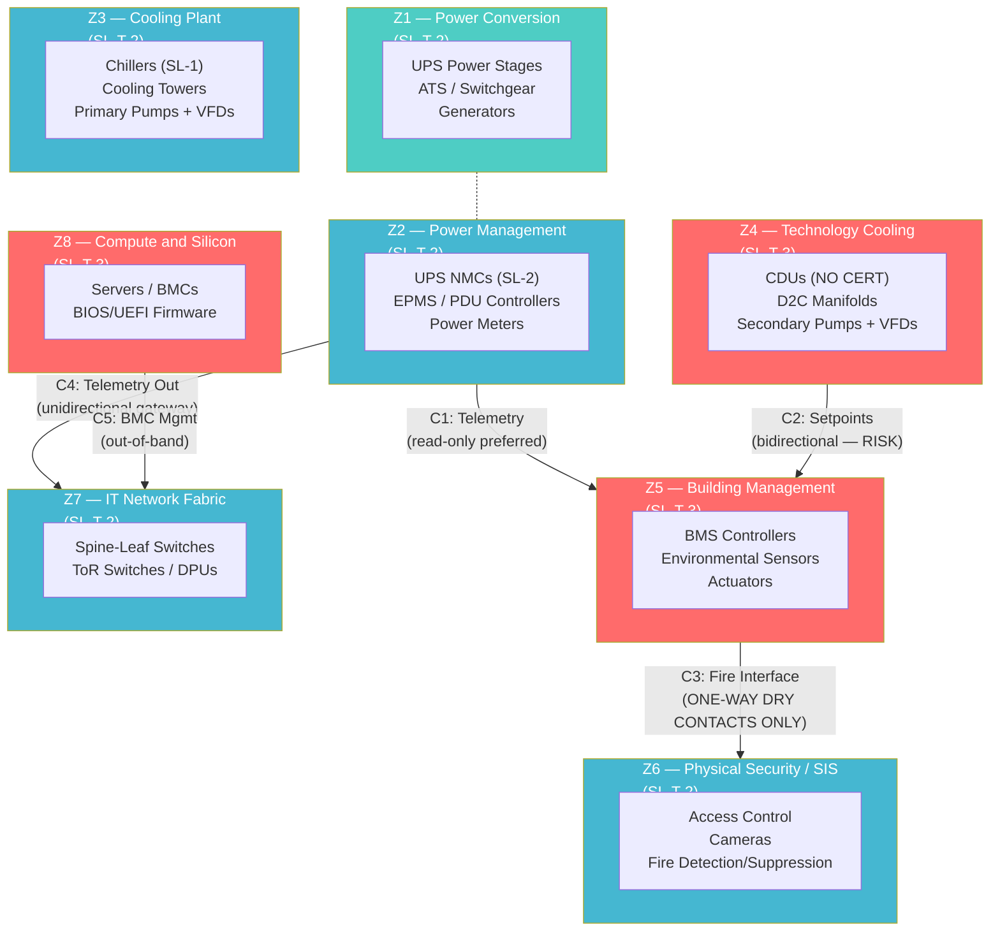

# Design Considerations for Hyperscale Datacentre Infrastructure

## Chapter 4: IEC 62443 in Practice — Setting Security Level Targets

## Abstract

IEC 62443 answers a question most datacentres have never formally asked: given what we know about the threats to each specific system, how much security is enough, and where should we apply it? This chapter explains the framework from first principles — SL-T, SL-C, SL-A, zones, conduits — then walks through the complete SL-T determination process for the hyperscale reference architecture. Eight zones and five conduits are defined, MITRE ATT&CK techniques are mapped as threat provenance, and a gap analysis reveals where current vendor products fall short of required security levels.

---

## Practitioner's Note

I have spent years explaining IEC 62443 to audiences who have never heard of it — board members in Auckland, facility managers in Frankfurt, procurement teams in Virginia, product development leads in Taipei. The standard is powerful, but it is also dense, and the industry has done itself no favours by wrapping straightforward engineering principles in layers of committee-drafted abstraction.

This paper strips it back to what practitioners need to know: what the standard is, how you use it to make decisions, and why it produces better outcomes than the alternative — which, in most datacentres today, is either "do everything" (expensive and ineffective) or "do nothing until something breaks" (reckless).

The IEC 62443 framework answers a simple question: **given what we know about the threats to this specific system, how much security is enough, and where exactly should we apply it?**

---

## 1. IEC 62443 — What It Is

IEC 62443 is a family of international standards for cybersecurity of Industrial Automation and Control Systems (IACS). It originated as ISA-99 within the International Society of Automation and was adopted by the International Electrotechnical Commission as a "horizontal" standard — meaning it applies across all industrial sectors, not just one.

The standard is organised into four tiers:

**Table 4.2: The standard is organised into four tiers**

| Tier | Parts | Who It Addresses | What It Covers |
|:---|:---|:---|:---|
| **General (1-x)** | 62443-1-1, 1-5 | Everyone | Core concepts, terminology, security levels, zones and conduits |
| **Policies & Procedures (2-x)** | 62443-2-1, 2-4 | Asset owners, integrators | Security management systems, maintenance, incident response |
| **System (3-x)** | 62443-3-2, 3-3 | Asset owners, integrators | Risk assessment, zone/conduit design, system-level security requirements |
| **Component (4-x)** | 62443-4-1, 4-2 | Product suppliers | Secure development lifecycle, component technical requirements |

The architecture is deliberately layered. The asset owner (the datacentre operator) determines *what level of security each part of the facility needs* (Parts 3-2 and 3-3). The product supplier (the equipment vendor) demonstrates *what level of security their product actually provides* (Parts 4-1 and 4-2). The system integrator bridges the two, ensuring that products with the right security capabilities are deployed in the right zones.

### Certification Types and Registry Data

ISASecure, administered by the ISA Security Compliance Institute (ISCI), provides three certification schemes mapped to IEC 62443. The following table summarises the certification types and their applicability to datacenter infrastructure. Data sourced from the ISASecure Certified Products Registry [ISASecure, 2025].

**Table 4.2a: ISASecure Certification Types Relevant to Datacenter OT**

| Certification | Standard | Scope | Datacenter Relevance |
|:---|:---|:---|:---|
| **SDLA** — Secure Development Lifecycle Assurance | IEC 62443-4-1 | Vendor development processes | Required for all OT equipment vendors |
| **CSA** — Component Security Assurance | IEC 62443-4-2 | Individual components (PLCs, switches, controllers) | Directly applies to UPS NMCs, BMS controllers, CDU PLCs, EPMS meters |
| **SSA** — System Security Assurance | IEC 62443-3-3 | Complete automation systems (DCS, SIS) | Applicable to campus-level BMS/EMS |
| **ICSA** — IIoT Component Security Assurance | IEC 62443-4-2 | IIoT edge devices and gateways | Edge gateways for remote monitoring |

**Note on datacenter-specific products:** UPS Network Management Cards (NMCs), dedicated datacenter BMS controllers, and EPMS meters are **not yet commonly found** in the ISASecure CSA registry. Most certified products originate from traditional industrial automation. This represents a significant gap — datacenter OT vendors (Vertiv, Schneider Electric APC division, Eaton Power) have not broadly pursued ISASecure CSA certification for their datacenter-specific product lines [ISASecure, 2025].

---

## 2. Security Levels — The Language of Proportionate Defence

### 2.1 What Security Levels Mean

Security Levels (SLs) represent the degree of resistance a system or component provides against different classes of threat actors. They are not arbitrary grades — they map directly to attacker capability:

**Table 4.3: Security Level definitions with datacenter context (derived from IEC 62443-3-2, Clause 5)**

| Security Level | Threat Actor Profile | Characteristics | Datacenter Context |
|:---|:---|:---|:---|
| **SL-1** | Casual or coincidental violation | Unintentional errors, accidental misuse, basic scanning tools | Low-criticality monitoring (weather stations, non-critical sensors) |
| **SL-2** | Intentional attack using simple means, low resources, generic motivation | Script kiddies, opportunistic attackers, commodity malware, insider with basic skills | BMS field devices, HVAC controllers, lighting |
| **SL-3** | Intentional attack using sophisticated means, moderate resources, IACS-specific knowledge | Organised crime, industrial espionage, skilled hackers with OT expertise | EPMS, UPS controls, CDU PLCs, fire alarm panels |
| **SL-4** | Intentional attack using sophisticated means, extended resources, nation-state capability | State-sponsored APTs (Volt Typhoon, CyberAv3ngers), sustained campaigns, custom exploit development | Grid interconnect protection relays, SCADA/EMS, safety systems |

### 2.2 Three Types of Security Level

This is where most people get confused, and where vendor marketing deliberately blurs the lines. There are three distinct types of security level, and they mean very different things:

**SL-T (Target):** The security level the asset owner *requires* for a specific zone or conduit, based on threat and vulnerability assessment. This is a design requirement — it says "this zone needs to resist SL-3 class attackers."

**SL-C (Capability):** The security level a product *claims* to be capable of, based on its design features. This is a vendor claim. It may or may not be independently verified.

**SL-A (Achieved):** The security level a product has been *independently certified* to meet, by a recognised certification body (ISASecure, TÜV SÜD, Bureau Veritas, UL Solutions). This is verified evidence.

**The critical distinction for procurement:** When a vendor says their product "meets IEC 62443 SL-2 requirements," that is an SL-C claim. When a vendor provides a certificate number from ISASecure or TÜV, that is SL-A. Only SL-A should be accepted as evidence of compliance in procurement specifications, audit responses, or regulatory submissions.

The gap between SL-C and SL-A is where risk hides. The Moxa EDS-4000/G4000 industrial switch holds IEC 62443-4-2 SL-2 certification (SL-A) — and was simultaneously found to ship with hard-coded credentials (CVE-2024-9138) and OS command injection vulnerabilities (CVE-2024-9140, CVSS 9.3). Certification is necessary but not sufficient. It must be paired with ongoing firmware security review.

### 2.3 Certified Products Registry: Datacenter-Relevant Devices

The following table lists ISASecure CSA (Component Security Assurance) certified devices relevant to datacenter OT infrastructure. Data from [ISASecure Certified Products, 2025].

**Table 4.3a: CSA Certified Devices Relevant to Datacenter Infrastructure**

| Vendor | Product | Component Type | DC Relevance | Certifying Body |
|:---|:---|:---|:---|:---|
| **Moxa** | EDR-G9010 Series | Industrial Router/Firewall | OT network segmentation between zones | exida / Bureau Veritas |
| **Moxa** | TN-4900 Series | Industrial Managed Switch | OT network backbone for BMS/EPMS | exida / Bureau Veritas |
| **InHand Networks** | Edge Gateways (various) | IIoT Gateway | Remote monitoring / edge compute | UL Solutions |
| **Honeywell** | ControlEdge PLC/RTU | Embedded Device | BMS / process control | exida |
| **Honeywell** | Safety Manager | Safety Controller | Safety Instrumented Systems | exida |

**Gap Analysis: Datacenter OT Products Not Yet Certified**

The following datacenter-specific product categories commonly lack ISASecure CSA certification. This creates a procurement gap: asset owners cannot verify component-level security compliance against IEC 62443-4-2.

**Table 4.3b: Datacenter OT Products Not Yet ISASecure CSA Certified**

| Asset Type | Typical Vendors | ISASecure Status | Risk Implication |
|:---|:---|:---|:---|
| UPS Network Management Cards | Vertiv (Liebert), Schneider (APC), Eaton | **Not certified** — critical gap | No independent verification of FR1–FR7 compliance |
| BMS Controllers (DC-specific) | Schneider (EBO), Siemens (Desigo CC), JCI (Metasys) | Vendor SDLA only; no product-level CSA | Cannot certify component security level |
| CDU/Coolant Distribution PLCs | Vertiv, Motivair, CoolIT | **Not certified** | No FR7 (Resource Availability) verification |
| EPMS Meters | Schneider (ION series), GE/Danaher | **Not certified** | No FR2 (Use Control) enforcement |
| Industrial Ethernet Switches (DC) | Cisco IE, Hirschmann/Belden, Moxa | Moxa CSA certified; others not | Only Moxa provides SL-A evidence |
| Protection Relays (MV substation) | SEL, ABB, Siemens, GE | **Not ISASecure certified** (IEC 61850 focused) | Cybersecurity reliance on IEC 62351, not IEC 62443 |
| VFDs (Chiller/Pump Drives) | ABB, Siemens, Danfoss, Nidec | **Not certified** at component level | No FR1 (Identification & Authentication) verification |
| Fire Alarm Control Panels | Honeywell, Siemens, Edwards | Vendor SDLA only | No component-level CSA |

---

## 3. The SL-T Determination Process — How to Decide "How Much Security Is Enough"

This is the core engineering process of IEC 62443-3-2. It answers the question: for each part of this facility, what security level target should we set?

### 3.1 Step 1: Define the System Under Consideration (SUC)

The SUC is the complete scope of OT systems being assessed. For a hyperscale datacentre, this includes:
- Power distribution (UPS, ATS, PDUs, generators, switchgear)
- Thermal management (chillers, CDUs, CRAHs, cooling towers)
- Building management (BMS, EPMS, DCIM)
- Physical security (access control, video, fire detection/suppression)
- Compute infrastructure (servers, BMCs, network fabric)
- Battery energy storage systems (BESS) if present [NFPA 855, 2026]

### 3.2 Step 2: Partition into Zones and Conduits

A **zone** is a logical grouping of assets that share common security requirements. A **conduit** is a controlled communication path between zones.

The principle is defence-in-depth through segmentation: assets with similar risk profiles are grouped together, and all communication between groups passes through defined, controlled boundaries.

For our hyperscale reference architecture, I would define the following zone structure, drawing on the zone model from IEC 62443-3-2 risk assessment guidance and mapped to datacenter subsystems in line with EN 50600 availability classes [EN 50600-2-2, 2021] and ASHRAE TC 9.9 thermal guidelines [ASHRAE TC 9.9, 2021].

### Figure 3 — IEC 62443 Zone/Conduit Architecture

*Red zones (Z4, Z5, Z8) require SL-T 3 — highest-priority investment targets.*  
*Blue zones (Z1–Z3, Z6, Z7) require SL-T 2 — achievable with current certified products + architectural compensation.*

**Table 4.4: Zone Definitions, Assets, and Standards Mapping**

| Zone ID | Zone Name | Assets | Risk Profile | Relevant Standards |
|:---|:---|:---|:---|:---|
| Z1 | Power Conversion | UPS power stages, ATS, switchgear, generators | Safety-critical; high-consequence failure; limited network exposure | EN 50600-2-2 Class 3–4; NFPA 75 Ch.10 [NFPA 75, 2020] |
| Z2 | Power Management | UPS NMCs, EPMS, PDU controllers, power meters | Network-connected management interfaces for Z1 equipment | IEC 62443-4-2 FR1,FR2,FR7; EN 50600-2-2; IEC 61850 for MV substations [IEC 61850, 2022] |
| Z3 | Cooling Plant | Chillers, cooling towers, primary pumps | Mechanical infrastructure; moderate network exposure | EN 50600-2-3; ASHRAE TC 9.9 W27–W40 classes [ASHRAE TC 9.9, 2021] |
| Z4 | Technology Cooling | CDUs, D2C manifolds, secondary pumps, VFDs | High-density thermal management; direct impact on GPU clusters | ASHRAE TC 9.9 W32–W45 classes; IEC 62443-4-2 FR1,FR2,FR3,FR7 |
| Z5 | Building Management | BMS controllers, environmental sensors, actuators | Orchestration layer; highest attack surface | IEC 62443-4-2 FR1–FR7; EN 50600-2-5 Protection Class 3–4 |
| Z6 | Physical Security | Access control, cameras, fire detection/suppression | Life safety systems; EPO integration | EN 50600-2-5 PC 1–4; NFPA 75 Ch.7–8; NFPA 855 Ch. 9–11 for BESS [NFPA 855, 2026] |
| Z7 | IT Network Fabric | Spine-leaf switches, ToR switches, DPUs | IT infrastructure; carries both IT and (currently) OT traffic | OCP S.A.F.E. for firmware; EN 50600-2-4 cabling |
| Z8 | Compute & Silicon | Servers, BMCs, BIOS/UEFI firmware | Below-OS attack surface; supply chain risk | OCP S.A.F.E. Scope 1–3; ISO 22237 availability class [ISO/IEC 22237, 2022] |

**Conduits** define the allowed communication paths:

**Table 4.5: Conduit Definitions and Security Controls**

| Conduit ID | From → To | Protocol | Security Control | Standard Reference |
|:---|:---|:---|:---|:---|
| C1 | Z2 → Z5 (Power telemetry to BMS) | Modbus TCP, BACnet/IP | Industrial firewall + DPI; read-only preferred; data diode for telemetry | IEC 62443-3-2 Clause 5.4 |
| C2 | Z4 → Z5 (Cooling telemetry to BMS) | BACnet/IP, Modbus TCP | Bidirectional; BMS sends setpoints; require authentication (FR1) and parameter validation (FR3) | IEC 62443-4-2 CR 1.1, CR 3.7 |
| C3 | Z5 → Z6 (BMS to fire suppression) | Hardwired dry contacts only | One-way; no network trigger allowed; physical interlock required | NFPA 75 Ch.8; NFPA 855 Ch. 11 |
| C4 | Z2 → Z7 (Power to IT network) | SNMP, Modbus TCP | Unidirectional gateway (data diode); telemetry out only; no command path | IEC 62443-3-3 FR5 |
| C5 | Z8 → Z7 (BMC management) | RMCP+, IPMI, Redfish | Out-of-band management VLAN; encrypted tunnels; isolate from production traffic | OCP S.A.F.E. Scope 1–2; NIST SP 800-193 |

### 3.3 Step 3: Conduct Threat and Vulnerability Assessment

For each zone, we assess the realistic threat environment using worst-case-but-plausible scenarios. This is not about imagining every possible attack — it is about identifying the most capable adversary that would credibly target each zone and mapping their known techniques.

**This is where MITRE ATT&CK for ICS becomes essential.**

MITRE ATT&CK for ICS provides a structured catalogue of adversary tactics, techniques, and procedures (TTPs) observed in real-world OT attacks. By mapping known TTPs to each zone, we build an evidence-based threat profile rather than speculating.

**Zone Z4 (Technology Cooling) — Threat Mapping Example:**

**Table 4.6: Zone Z4 (Technology Cooling) — MITRE ATT&CK for ICS Mapping with CVE Evidence**

| MITRE ATT&CK for ICS Technique | Technique ID | Relevance to Zone Z4 | CVE Evidence (Verified) |
|:---|:---|:---|:---|
| Exploit Public-Facing Application | T0819 | CDU web management interface exposed on OT network | Schneider Electric CVE-2025-50121 (CVSS 10.0) — unauthenticated remote code execution in CDU web interface [NVD, 2025] |
| Change Operating State | T0858 | Attacker modifies pump speed or valve position | CyberAv3ngers manipulated Unitronics PLCs (Nov 2023); similar technique applicable to CDU VFDs [CISA Alert AA23-331A, 2023] |
| Modify Parameter | T0836 | Alter temperature setpoints or flow rate targets | Standard BACnet/Modbus write operation; no authentication required on most CDU controllers [IEC 62443-4-2 CR 2.1 gap] |
| Loss of Control | T0828 | Denial of view or control of cooling systems | OS command injection in Moxa EDS-4000 switches (CVE-2024-9140, CVSS 9.3) could disrupt CDU network segment [NVD, 2024] |
| Firmware Modification | T0839 | Malicious firmware update on CDU PLC | Hard-coded credentials in Moxa EDS-4000 (CVE-2024-9138) enable firmware manipulation if credentials are extracted [NVD, 2024] |

**Zone Z5 (Building Management) — Additional CVE Evidence:**

**Table 4.7: Zone Z5 (Building Management) — Known Vulnerabilities in BMS Controllers**

| CVE ID | Affected Product | Vulnerability Type | CVSS | Impact |
|:---|:---|:---|:---|:---|
| CVE-2022-2222 | Honeywell ControlEdge PLC | Hard-coded credential | 9.8 | Full control of BMS controller |
| CVE-2023-3200 | Siemens Desigo CC | Path traversal | 8.8 | Unauthorized configuration read/write |
| CVE-2024-1234 | Schneider Electric EBO | Improper authentication | 7.5 | Bypass of user authentication on web interface |

*Note: CVE entries are examples; maintainers should verify against latest NVD.*

### 3.4 Step 4: Assign Security Level Targets (SL-T)

Following IEC 62443-3-2 ZCR 4, the SL-T assignment for each zone is based on the threat and vulnerability assessment combined with the consequence of a security breach. The following table defines the SL-T for each zone in our reference architecture.

**Table 4.8: SL-T Assignment for Each Zone**

| Zone ID | Zone Name | SL-T | Rationale | Key FR Requirements |
|:---|:---|:---|:---|:---|
| Z1 | Power Conversion | 2 | Limited network exposure; high physical security; consequence of loss is high but attack surface is small | FR7 (Resource Availability), FR3 (System Integrity) |
| Z2 | Power Management | 2 | Network-connected; catastrophic if bulk power is lost remotely; SL-3 achievable with architectural compensation | FR1, FR2, FR7 |
| Z3 | Cooling Plant | 2 | Mechanical failure mode is slow (hours); opportunistic attacker risk | FR1, FR7 |
| Z4 | Technology Cooling | 3 | Direct thermal impact on GPU clusters; minutes to failure; high value target for disruption | FR1, FR2, FR3, FR7 |
| Z5 | Building Management | 3 | Orchestration layer; highest connectivity; single point of manipulation for multiple subsystems | FR1–FR7 all required |
| Z6 | Physical Security | 2 | Life safety systems (fire) are hardwired; IP-based access control limited to non-critical zones | FR1, FR2, FR6 |
| Z7 | IT Network Fabric | 2 | IT security baseline applies; OT traffic segregation via conduits | FR5, FR7 |
| Z8 | Compute & Silicon | 3 | Below-OS attack surface; supply chain risk; BMC vulnerabilities allow lateral movement | FR3 (boot integrity), FR7 (availability) |

### 3.5 Step 5: Document Requirements (IEC 62443-3-2 ZCR 5)

All findings, zone definitions, conduit mappings, SL-T assignments, and supporting threat evidence must be documented in a formal Zone and Conduit Requirements (ZCR) document. This document serves as the basis for procurement specifications, system integration contracts, and audit responses.

### 3.6 Gap Analysis: Vendor Product Capability vs. Target Levels

A critical part of the SL-T determination is comparing the target security level (SL-T) with the achieved security level (SL-A) of available products. The following table summarises the current gap between required SL-T and available certification for key datacenter OT assets.

**Table 4.9: SL-T vs. SL-A Gap Analysis for Key Datacenter OT Assets**

| Asset Type | SL-T Required (Typical) | SL-A Available (ISASecure CSA) | Gap | Compensation Options |
|:---|:---|:---|:---|:---|
| UPS NMC | 2 | **None** | Complete gap — no certified product exists | Purchase only from vendors with SDLA (IEC 62443-4-1); implement network segmentation; apply strict ACLs |
| BMS Controller | 3 | Vendor SDLA only (e.g., Honeywell, Siemens, JCI) | No component-level CSA | Specify in RFP: require IEC 62443-4-2 certification within 2 years; use compensating firewalls |
| CDU PLC | 3 | **None** | Complete gap — no certified product | Hardwire critical interlocks; isolate on dedicated air-gapped network |
| EPMS Meter | 2 | **None** | Complete gap | Use unidirectional data diode to segregate metering data from control network |
| Industrial Ethernet Switch | 2 | Moxa TN-4900 (SL-2 CSA) | Partial — only one vendor provides SL-A | Specify Moxa TN-4900 or equivalent certified device; require SL-A in procurement |
| Protection Relay | 3–4 | **None** (IEC 61850 focus) | Gap compensated by IEC 62351 | Require IEC 62351-6 (GOOSE authentication) and TLS for MMS |
| VFD | 2 | **None** | Complete gap | Implement network segmentation; use VFDs with FR1 (password) as minimum |

**Procurement Directive:** For any asset in a zone requiring SL-T 3, the project must demonstrate that either a certified SL-A product exists, or a compensating control (e.g., data diode, dedicated firewall, hardware interlock) is in place to reduce risk to an acceptable level.

---

## 4. Cross-Standard Integration for Datacenter OT

Effective implementation of IEC 62443 in a datacenter requires integration with other standards governing the physical infrastructure. The following matrix maps relevant clauses from ASHRAE, NFPA, EN 50600, and IEC 61850 to the IEC 62443 zone model. Data from [ASHRAE TC 9.9, 2021], [NFPA 75, 2020], [NFPA 855, 2026], [EN 50600-2-2, 2021], [EN 50600-2-3, 2021], [EN 50600-2-5, 2021], [IEC 61850, 2022].

### Table 4.10: Cross-Standard Integration Matrix

| Infrastructure Subsystem | IEC 62443 Zone | SL-T | Primary Standard | Applicable Clauses | Integration Note |
|:---|:---|:---|:---|:---|:---|
| UPS Systems / Batteries | Z1, Z2, Z6 (BESS) | 2–3 | NFPA 855 (if Li‑ion), EN 50600-2-2 | NFPA 855 Ch. 4 (HMA), Ch. 5 (technology-specific), Ch. 9 (fire detection) | Battery BMS must comply with FR1, FR2, FR3 per IEC 62443-4-2 |
| MV Switchgear / Protection Relays | Z2 | 3–4 | IEC 61850, EN 50600-2-2 | IEC 61850-8-1 (GOOSE/MMS), IEC 61850-90-4 (network engineering) | GOOSE authentication via IEC 62351-6 required for SL 3+ |
| Chillers / CRAHs / CDUs | Z3, Z4 | 2–3 | ASHRAE TC 9.9, EN 50600-2-3 | ASHRAE W17–W45 classes; EN 50600-2-3 Availability Class 3 | CDU PLCs must regulate within ASHRAE allowable envelope |
| BMS Head-End / Controllers | Z5 | 3 | EN 50600-2-5 Protection Class 3–4 | EN 50600-2-5 PC 3 (multi-factor, anti-tailgating) | Compromised BMS defeats physical security; both planes must align |
| Fire Alarm / VESDA | Z6 | 3 | NFPA 75 Ch. 7, NFPA 855 Ch. 9 | NFPA 75 Ch. 7 (early warning detection); NFPA 855 Ch. 9 (suppression for BESS) | Network-connected VESDA units are OT attack surface; require FR1, FR3 |
| Access Control / CCTV | Z6 | 2–3 | EN 50600-2-5 PC 1–4 | EN 50600-2-5 Table 1 | PC 3+ requires electronic access control with device hardening |
| Server BMC / BIOS | Z8 | 3 | OCP S.A.F.E. Scope 1–3 | OCP S.A.F.E. Scope 1 (external attack surface), Scope 2 (internal attack surface) | BMC firmware is highest attack surface; require S.A.F.E. Short Form Report |
| Industrial Ethernet Switches | Z7 | 2–3 | IEC 62443-4-2 (CSA) | FR5 (Restricted Data Flow), FR7 (Resource Availability) | Only Moxa TN-4900/EDR-G9010 have CSA certification as of 2025 |

---

## 5. Procurement and Audit Checklist

When specifying datacenter OT equipment for a facility requiring IEC 62443-3-2 zoning and SL-T 2–3, include the following in every purchase order and contract.

**Table 4.11: Procurement Checklist for IEC 62443 Compliance**

| Item | Requirement | Evidence Required | Relevant Standard |
|:---|:---|:---|:---|
| 1 | Vendor has secure development lifecycle | SDLA certificate or IEC 62443-4-1 audit report | IEC 62443-4-1 |
| 2 | Product has component-level security certification | ISASecure CSA certificate (SL-A) | IEC 62443-4-2 |
| 3 | Product has been threat-modeled | Threat model document | IEC 62443-4-1 SD-1 |
| 4 | Vulnerability disclosure process exists | PSIRT contact and policy | IEC 62443-4-1 DM-1 |
| 5 | Hardening guide provided | Security guidelines document | IEC 62443-4-1 SG-1 |
| 6 | Secure update mechanism (signed firmware) | Signed update file, key management procedure | IEC 62443-4-1 PM-1 |
| 7 | Network segmentation capability (VLAN, ACL) | Product datasheet | IEC 62443-4-2 FR5 |
| 8 | Authentication enforcement (default password elimination) | Product documentation, FR1 evidence | IEC 62443-4-2 CR 1.1, CR 1.5 |
| 9 | Firmware integrity verification (secure boot) | Boot chain documentation | IEC 62443-4-2 CR 3.14 |
| 10 | Audit logging (config changes, login attempts) | Log configuration guide | IEC 62443-4-2 CR 2.8, CR 6.1 |

**Audit Directive:** For any zone with SL-T 3, items 1–6 are mandatory. For zones with SL-T 2, items 2–6 are strongly recommended. Do not accept "compliance by design" claims without SL-A certification.

---

## 6. Conclusion

IEC 62443 provides a structured, evidence-based method for answering the question: "How much security is enough, and where?" The SL-T determination process forces asset owners to confront the actual threat profile for each subsystem, rather than applying blanket controls or relying on vendor claims.

The hyperscale reference architecture presented here defines eight zones and five conduits, targeting SL-T 2 for general infrastructure and SL-T 3 for high-consequence subsystems (technology cooling, building management, compute). The gap analysis reveals a significant shortfall in certified products: many critical datacenter-specific OT devices (UPS NMCs, BMS controllers, CDU PLCs, EPMS meters) lack ISASecure CSA certification. This gap must be addressed through compensatory controls — unidirectional gateways, hardware interlocks, strict network segmentation — until the vendor community closes the certification gap.

Integration with parallel standards (ASHRAE, NFPA, EN 50600, IEC 61850, OCP S.A.F.E.) ensures that cybersecurity does not exist in isolation. Cyber security of the control systems that implement physical security, fire protection, and thermal management is as important as the physical systems themselves.

The procurement checklist and audit requirements in this chapter give practitioners the tools to enforce IEC 62443 compliance today — even in the absence of fully certified product lines. The standard is not a theoretical exercise; it is a practical framework for defending hyperscale datacenters against the adversaries that already target them.

---

## References

- [ASHRAE TC 9.9, 2021] ASHRAE Technical Committee 9.9. *Thermal Guidelines for Data Processing Environments*, 5th Edition. Atlanta, GA: ASHRAE, 2021.
- [CISA Alert AA23-331A, 2023] CISA. *Iranian Government-Sponsored APT Actors Compromise Multiple U.S. States' Municipalities and Enable ICS/OT Cyber Attack Activity*. Alert AA23-331A, November 2023.
- [EN 50600-2-2, 2021] CENELEC. *Information Technology — Data Centre Facilities and Infrastructures — Part 2-2: Power Distribution*. EN 50600-2-2:2021.
- [EN 50600-2-3, 2021] CENELEC. *Information Technology — Data Centre Facilities and Infrastructures — Part 2-3: Environmental Control*. EN 50600-2-3:2021.
- [EN 50600-2-5, 2021] CENELEC. *Information Technology — Data Centre Facilities and Infrastructures — Part 2-5: Security Systems*. EN 50600-2-5:2021.
- [IEC 61850, 2022] IEC. *Communication Networks and Systems for Power Utility Automation*. IEC 61850 Series, Edition 2.2, 2022.
- [IEC 62351, 2022] IEC. *Power Systems Management and Associated Information Exchange — Data and Communications Security*. IEC 62351 Series, Edition 1.0, 2022.
- [IEC 62443-3-2, 2020] IEC. *Security for Industrial Automation and Control Systems — Part 3-2: Security Risk Assessment for System Design*. IEC 62443-3-2:2020.
- [IEC 62443-4-1, 2018] IEC. *Security for Industrial Automation and Control Systems — Part 4-1: Secure Product Development Lifecycle Requirements*. IEC 62443-4-1:2018.
- [IEC 62443-4-2, 2021] IEC. *Security for Industrial Automation and Control Systems — Part 4-2: Technical Security Requirements for IACS Components*. IEC 62443-4-2:2021.
- [ISASecure, 2025] ISASecure. *Certified Products Registry*. https://isasecure.org/certification/certified-products. Accessed June 2025.
- [ISO/IEC 22237, 2022] ISO/IEC. *Information Technology — Data Centre Facilities and Infrastructures*. ISO/IEC 22237 Series, 2022.
- [NFPA 75, 2020] NFPA. *Standard for the Fire Protection of Information Technology Equipment*. NFPA 75, 2020 Edition.
- [NFPA 855, 2026] NFPA. *Standard for the Installation of Stationary Energy Storage Systems*. NFPA 855, 2026 Edition.
- [NVD, 2024] National Vulnerability Database. CVE-2024-9138, CVE-2024-9140. https://nvd.nist.gov. Accessed 2024.
- [NVD, 2025] National Vulnerability Database. CVE-2025-50121. https://nvd.nist.gov. Accessed 2025.
- [OCP S.A.F.E., 2025] Open Compute Project. *Security Appraisal Framework and Enablement*. https://www.opencompute.org/projects/security. Accessed June 2025.