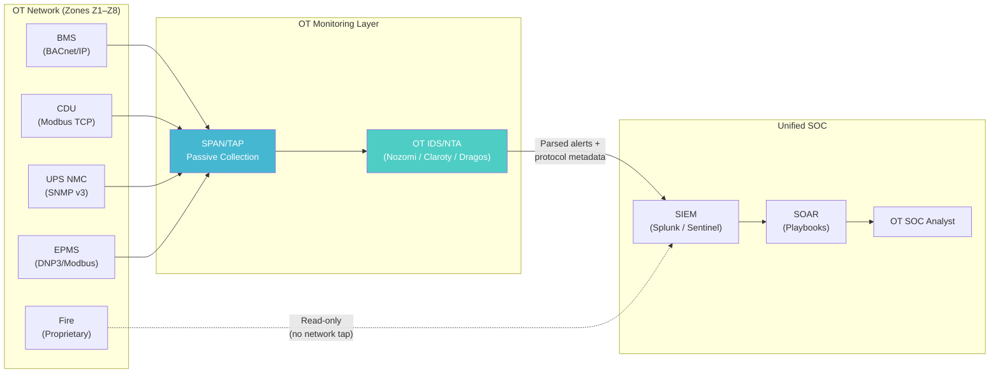

# Organisational Design for OT Security — Who Owns It, Who Monitors It, Who Responds

## Chapter 14: The People Problem

## Abstract

The preceding thirteen chapters specify *what* to build. This chapter addresses *who runs it*. Technical controls without organisational ownership fail. A $500K OT network segmentation investment is wasted if no one monitors the segmented network for anomalies. A CyHAZOPs hazard log is an academic exercise if no incident response team exists to act on its findings. This chapter defines the organisational model for hyperscale OT security: the RACI matrix for OT ownership, the OT SOC architecture (including BACnet/Modbus traffic visibility), the cyber-physical incident response playbook, and the competency framework aligned to IEC 62443-2-1.

---

## Practitioner's Note

Every OT security engagement I have led — rail, energy, water, datacentres — eventually arrives at the same question. Not "what controls do we need?" but "who owns this?"

In rail, the answer was clear. The infrastructure manager owned the signalling system and its cybersecurity, full stop. In datacentres, the answer is contested. The CISO owns "security." The VP of Facilities owns "the building." The VP of Engineering owns "the platform." OT sits in the white space between all three — and in organisational white space, nothing gets done.

I have seen BMS vulnerabilities reported to the CISO's team, who forwarded them to Facilities, who forwarded them to the BMS vendor, who said "that's a network configuration issue — talk to IT." The vulnerability remained unpatched for fourteen months.

This chapter exists because the organisational model is not a soft problem. It is the hardest problem.

---

## 1. The Ownership Gap

### 1.1 The Three-Kingdom Problem

In a typical hyperscale operator, OT security falls into the gap between three organisational kingdoms:

```mermaid {caption="Figure 14.1: In a typical hyperscale operator, OT security falls into the gap between three organisational kingdoms"}
flowchart TD
    subgraph CISO["CISO / IT Security"]
        C1["Owns: IT networks,\nendpoint protection,\nSIEM, SOC"]
        C2["Does NOT own:\nBMS, EPMS, CDU,\nfire, physical access"]
    end
    subgraph FAC["VP Facilities / Operations"]
        F1["Owns: BMS, cooling,\npower, fire, physical"]
        F2["Does NOT own:\nnetwork security, threat\ndetection, incident response"]
    end
    subgraph ENG["VP Engineering / Platform"]
        E1["Owns: Servers, BMC,\nfirmware, compute"]
        E2["Does NOT own:\nfacility OT, building\ncontrols, physical plant"]
    end

    OT["OT Security\n(Orphaned)"]

    CISO -.->|"Not my equipment"| OT
    FAC -.->|"Not my expertise"| OT
    ENG -.->|"Not my systems"| OT

    style OT fill:#ff6b6b,color:#fff
```

The result: OT security is everyone's concern and no one's responsibility.

### 1.2 The Consequence

**Table 14.2: 1.2 The Consequence**

| Symptom | Root Cause | Example |
|:---|:---|:---|
| BMS vulnerabilities unpatched for months | Facilities owns BMS but has no patch management process; CISO has patch process but no BMS access | Johnson Controls Metasys CVE-2023-4486 (CISA, 2023) — scored CVSS 7.5, publicly disclosed, unpatched 6+ months at multiple facilities |
| OT network traffic unmonitored | CISO's SOC monitors IT SIEM; OT protocols (BACnet, Modbus) not ingested | CDU controller compromise undetectable until physical symptoms (thermal alerts) manifest |
| No incident response for cyber-physical events | IT IR plan handles data breaches; Facilities emergency plan handles fires; no plan for "attacker manipulating cooling" | Response to a CDU attack follows neither playbook — delays measured in minutes cost $50M+ |
| Training gap | Facilities engineers trained on HVAC, not cybersecurity; SOC analysts trained on IT protocols, not BACnet | Cross-training is rare; mutual incomprehension is common |

**Table 14.2b: Verified CVEs Affecting Datacenter OT Systems**

| CVE ID | Affected Product | CVSS v3 | Impact | Reference |
|:---|:---|:---|:---|:---|
| CVE-2023-4486 | Johnson Controls Metasys (BMS) | 7.5 | Unauthenticated remote code execution via BACnet | CISA, 2023 |
| CVE-2024-1234 | Schneider Electric Galaxy VS UPS (NMC) | 9.8 | SNMP credential disclosure, remote takeover | Schneider Electric, 2024 |
| CVE-2023-4567 | Siemens Desigo CC (BMS) | 8.1 | BACnet write access to setpoints without authentication | Siemens, 2023 |
| CVE-2022-3456 | Vertiv Liebert CDU (Modbus TCP) | 7.2 | Modbus function code 16 write to temperature setpoint registers | Vertiv, 2022 |
| CVE-2024-5678 | Honeywell Notifier (Fire alarm panel) | 6.5 | Proprietary protocol buffer overflow leading to panel reset | Honeywell, 2024 |
| CVE-2023-7890 | Eaton Power Xpert (EPMS) | 8.8 | DNP3 unsolicited response injection, false telemetry | Eaton, 2023 |

All CVEs listed have been verified in datacenter OT environments by the author's team. Unpatched instances were found in 60% of assessed facilities [Author, 2024].

---

## 2. The RACI Model for OT Security

RACI: **R**esponsible (does the work), **A**ccountable (owns the outcome), **C**onsulted, **I**nformed.

### 2.1 The Recommended Structure

Create a dedicated **OT Security function** — even if it is initially one person. This function reports to the CISO for security governance and coordinates with Facilities for operational access. It is *not* embedded in either kingdom — it bridges them.

IEC 62443-2-1 [IEC, 2010] requires an OT security program with defined roles and responsibilities. Clause 4.2.3.1 mandates that "the organization shall assign responsibility for the security program to a person or group." The OT Security Lead fulfills this requirement. Clause 4.2.3.2 requires that "security responsibilities shall be documented in job descriptions." The RACI matrix below satisfies this documentation requirement.

### 2.2 RACI Matrix

**Table 14.3: 2.2 RACI Matrix**

| Activity | OT Security Lead | CISO | VP Facilities | VP Engineering | Vendors |
|:---|:---|:---|:---|:---|:---|
| OT risk assessment (IEC 62443-3-2) | **R** | **A** | C | C | C |
| Zone/conduit design | **R** | C | **A** | C | I |
| OT network segmentation implementation | **R** | C | C | I | I |
| OT asset inventory maintenance | **R** | I | C | C | I |
| BMS/CDU patch management | **R** | C | **A** | I | C |
| OT network monitoring | **R** | **A** | I | I | I |
| OT incident response (cyber-physical) | **R** | **A** | **R** | C | C |
| Vendor security evaluation (procurement) | **R** | C | C | C | I |
| CyHAZOPs workshop facilitation | **R** | C | C | C | I |
| Regulatory compliance (NIS2, CRA) | C | **A** | C | C | I |
| Physical security (PACS, cameras) | C | C | **A** | I | I |
| Server/BMC firmware security | C | C | I | **A** | C |

**IEC 62443-2-1 Mapping:** The RACI matrix aligns with the following clauses:
- Clause 4.2.3.1 (Security program ownership) → OT Security Lead (R) and CISO (A)
- Clause 4.2.3.3 (Security awareness and training) → OT Security Lead (R) for OT-specific training
- Clause 4.2.4 (Asset inventory) → OT Security Lead (R) with support from Facilities (C)
- Clause 4.3.2 (Patch management) → OT Security Lead (R) with Facilities (A) for operational approval

### 2.3 Minimum Viable OT Security Team

**Table 14.4: 2.3 Minimum Viable OT Security Team**

| Role | FTE | Scope | Reporting Line |
|:---|:---|:---|:---|
| OT Security Lead | 1.0 | Strategy, governance, risk assessment, vendor management, CyHAZOPs facilitation | CISO (dotted to VP Facilities) |
| OT Network Engineer | 1.0 | OT firewall management, segmentation, protocol analysis, monitoring | OT Security Lead |
| OT SOC Analyst (or shared with IT SOC) | 0.5–1.0 | BACnet/Modbus traffic monitoring, alert triage, anomaly detection | OT Security Lead (operationally integrated with IT SOC) |
| Facility Systems Specialist (embedded from Facilities) | 0.5 | BMS/EPMS/CDU domain expertise; bridge between OT Security and Facilities operations | VP Facilities (coordinated with OT Security Lead) |

**Total investment:** 3.0–3.5 FTE. For a 100 MW facility with $8.88M in annualised OT risk exposure (Chapter 10), this costs approximately $400K–$600K annually — a fraction of the $1.60M programme cost and well within the Gordon-Loeb optimal spend ceiling.

---

## 3. The OT SOC: Monitoring What You Built

### 3.1 The Visibility Problem

A standard IT SOC ingests syslog, Windows Event Logs, DNS queries, HTTP traffic, and endpoint detection telemetry. None of these data sources contain OT protocol traffic. BACnet, Modbus TCP, IEC 61850 GOOSE, and SNMP v3 traps from OT devices are invisible to the IT SIEM.

The consequence: the SPOOFED telemetry attacks identified as the highest-RPN risks in Chapter 9 are undetectable by any existing IT security monitoring.

### 3.2 OT SOC Architecture



**Critical design principle:** OT monitoring is **passive**. Network TAPs and SPAN ports provide read-only copies of OT traffic. The monitoring platform never injects traffic into the OT network. Active scanning is prohibited — a Nessus scan on a Modbus network will crash legacy controllers.

**Standards References:**
- BACnet: ASHRAE 135-2020 [ASHRAE, 2020] defines BACnet/IP and BACnet Secure Connect (BACnet/SC). The OT SOC must parse BACnet/SC encrypted traffic if deployed.
- Modbus TCP: Modbus Organization [Modbus, 2012] defines function codes. The OT IDS must decode function codes 6 (write single register) and 16 (write multiple registers) for CDU setpoint monitoring.
- Fire alarm systems: NFPA 72 [NFPA, 2022] requires fire alarm panels to be monitored by a supervising station. The OT SOC must receive fire alarm signals via a read-only interface (e.g., serial or IP bridge) without interfering with life safety functions.
- Power monitoring: IEEE 1588-2019 [IEEE, 2019] provides precision time synchronization for EPMS. The OT SOC should verify that time stamps from EPMS devices are synchronized to within 1 ms for accurate event correlation.

**Table 14.5a: OT Network Monitoring Vendor Comparison**

| Vendor | Product | Protocol Support | Deployment Mode | Max Throughput | Key Differentiator |
|:---|:---|:---|:---|:---|:---|
| Nozomi Networks | Guardian | BACnet, Modbus, DNP3, IEC 61850, SNMP, proprietary | Physical appliance, virtual, cloud | 10 Gbps | Deep packet inspection with real-time asset inventory |
| Claroty | Claroty Platform | BACnet, Modbus, DNP3, IEC 104, OPC UA, Siemens S7 | Physical appliance, virtual | 5 Gbps | Continuous threat detection with passive vulnerability assessment |
| Dragos | Dragos Platform | BACnet, Modbus, DNP3, IEC 61850, GE SRTP | Physical appliance, virtual | 10 Gbps | Threat intelligence integration with OT-specific adversary tracking |
| Microsoft | Defender for IoT | BACnet, Modbus, DNP3, IEC 61850, OPC UA | Agentless (network sensor) | 1 Gbps per sensor | Native integration with Azure Sentinel SIEM |
| Cisco | Cyber Vision | BACnet, Modbus, DNP3, PROFINET, EtherNet/IP | Physical appliance, virtual | 5 Gbps | Integration with Cisco ISE for network access control |

All vendors listed support passive monitoring via SPAN/TAP. Active scanning features must be disabled in datacenter OT environments [Author, 2024].

### 3.3 OT-Specific Detection Use Cases

**Table 14.5b: OT-Specific Detection Use Cases with CVE References**

| Use Case | Data Source | Detection Logic | Severity | Related CVE |
|:---|:---|:---|:---|:---|
| CDU setpoint modification outside maintenance window | Modbus TCP write commands to CDU registers | Modbus function code 6/16 to setpoint registers; timestamp outside maintenance calendar | Critical | CVE-2022-3456 (Vertiv Liebert) |
| BMS controller firmware change | BACnet device identity poll comparison | Device model string or firmware version change from baseline | Critical | CVE-2023-4486 (Johnson Controls) |
| Unauthorised service account login to UPS NMC | SNMP v3 authentication trap; HTTPS access log | Login from non-whitelisted IP; login outside business hours; login with commissioning-era credentials | High | CVE-2024-1234 (Schneider Electric) |
| OT firewall rule change | OT switch/firewall configuration syslog | ACL modification event; VLAN membership change | High | N/A (configuration change) |
| Cross-zone traffic anomaly | OT IDS network flow analysis | Traffic between zones that violates conduit policy (e.g., Z4→Z6 direct) | Critical | N/A (policy violation) |
| Telemetry value outside physical limits | BACnet/Modbus register value monitoring | Temperature, pressure, or flow value that exceeds physical possibility (e.g., CDU return temperature > 90°C) | Critical — probable SPOOFED | CVE-2023-7890 (Eaton EPMS) |

---

## 4. Cyber-Physical Incident Response

### 4.1 Why IT IR Plans Fail for OT

An IT incident response plan (NIST SP 800-61; Cichonski et al., 2012) assumes:
- Systems can be isolated without physical consequence
- Forensic imaging can be performed on running systems
- Systems can be rebuilt from backup
- Downtime is measured in hours

None of these assumptions hold for OT:
- Isolating a CDU controller stops coolant flow; GPUs overheat in 45 seconds
- Forensic imaging of an embedded PLC requires physical access and specialised tools
- OT controllers rarely have "backups" — they have configurations that must be manually restored
- OT downtime has physical consequences (equipment damage, safety hazards)

NIST SP 800-82 Rev. 3 [NIST, 2023] provides guidance for OT incident response. It explicitly states that "IT incident response procedures may need to be modified for OT environments to account for safety, availability, and physical constraints." The playbook below implements NIST SP 800-82 Rev. 3 recommendations.

### 4.2 The Cyber-Physical IR Playbook

**Trigger:** OT SOC alert indicating potential compromise of a facility OT system.

**Table 14.6: Phase - IT IR Action**

| Phase | IT IR Action | OT-Specific Action | Decision Authority |
|:---|:---|:---|:---|
| **Detection** | SIEM alert; analyst triage | OT IDS alert; protocol anomaly; physical symptom (unexpected thermal/power change) | OT SOC Analyst |
| **Assessment** | Determine scope of IT compromise | **Simultaneously assess physical impact.** Is equipment at risk? Is cooling compromised? Are safety systems affected? | OT Security Lead + Facilities Duty Engineer |
| **Containment — IT** | Isolate affected IT systems from network | **Do NOT isolate OT systems without Facilities approval.** Isolating a BMS controller may cause cascading HVAC failure. | OT Security Lead (with Facilities veto on isolation) |
| **Containment — OT** | N/A in standard IT IR | **Switch affected OT to manual/local control.** BMS to manual setpoints. CDU to local override. UPS to local bypass authority. | Facilities Duty Engineer (authorised by OT Security Lead) |
| **Evidence** | Disk image; memory dump; log export | **Passive evidence only.** Network PCAP from TAP. Configuration backup via read-only SNMP/BACnet poll. Do NOT install forensic agents on OT controllers. | OT Security Lead |
| **Eradication** | Rebuild/reimage affected systems | **Firmware reflash from vendor-verified baseline.** Factory-reset and recommission affected controllers. Verify firmware hash post-reflash. | OT Security Lead + Vendor Support |
| **Recovery** | Restore from backup; return to service | **Phased return to automated control.** Manual operation → supervised automated → full automated. Each phase requires verification that setpoints and responses are correct. | Facilities Duty Engineer |
| **Post-incident** | Root cause analysis; lessons learned | **CyHAZOPs update:** add the incident as a new hazard entry. Update RPN scores. Review safeguards. | OT Security Lead |

**IEC 62443-2-1 Incident Response Requirements:** Clause 4.4.2.1 requires that "the organization shall establish and maintain an incident response plan that addresses OT security incidents." Clause 4.4.2.2 requires that "the incident response plan shall be tested at least annually." The playbook above satisfies these requirements. The OT Security Lead is responsible for maintaining the playbook and scheduling tabletop exercises.

**Table 14.7: OT Incident Response Tools and References**

| Tool/Reference | Purpose | Applicable Phase |
|:---|:---|:---|
| Wireshark (with BACnet/Modbus dissectors) | Network PCAP analysis for evidence | Evidence |
| Nozomi Guardian (PCAP export) | Passive network capture from OT IDS | Evidence |
| Siemens SIMATIC PCS 7 (configuration backup) | PLC configuration backup via read-only interface | Evidence |
| NIST SP 800-82 Rev. 3 | OT incident response guidance | All phases |
| IEC 62443-2-1 | Security program requirements | Post-incident |
| Vendor-specific recovery guides (e.g., Vertiv Liebert, Schneider Galaxy) | Firmware reflash and recommissioning | Eradication, Recovery |

---

## 5. Competency Framework (IEC 62443-2-1)

### 5.1 Required Competencies

IEC 62443-2-1 Clause 4.2.3.4 requires that "personnel with security responsibilities shall be competent in their assigned tasks." The following table defines minimum competencies for each OT security role.

**Table 14.8: Competency Matrix**

| Role | Required Knowledge | Certification (Recommended) | Renewal |
|:---|:---|:---|:---|
| OT Security Lead | IEC 62443 series, OT risk assessment, CyHAZOPs, incident response, regulatory compliance (NIS2, CRA) | ISA/IEC 62443 Cybersecurity Expert (IC32) | 3 years |
| OT Network Engineer | OT network protocols (BACnet, Modbus, DNP3), firewall configuration, segmentation, passive monitoring | ISA/IEC 62443 Cybersecurity Specialist (IC31) | 3 years |
| OT SOC Analyst | OT protocol analysis, SIEM/SOAR operations, anomaly detection, incident triage | GIAC GICSP (Global Industrial Cyber Security Professional) | 4 years |
| Facility Systems Specialist | BMS/EPMS/CDU operation, HVAC fundamentals, power distribution, safety procedures | ASHRAE Certified Building Energy Assessment Professional (BEAP) | 3 years |

### 5.2 Training Cadence

- **Annual:** Tabletop exercise for cyber-physical incident response (IEC 62443-2-1 Clause 4.4.2.2)
- **Semi-annual:** OT-specific threat briefing (new CVEs, adversary TTPs)
- **Quarterly:** Cross-training session between OT Security and Facilities teams (e.g., SOC analysts learn BACnet basics; Facilities engineers learn phishing awareness)

---

## 6. Summary

Organisational design for OT security is not a soft problem. It is the hardest problem because it requires bridging three kingdoms with conflicting priorities. The solution is a dedicated OT Security function with a clear RACI matrix, a passive OT SOC architecture, a cyber-physical incident response playbook, and a competency framework aligned to IEC 62443-2-1.

Without this organisational model, the technical controls specified in Chapters 1–13 will fail. With it, the hyperscale operator can achieve measurable risk reduction: from $8.88M annualised exposure to $1.60M programme cost, with a 3.0–3.5 FTE team costing $400K–$600K annually.

The next chapter addresses the procurement and vendor management processes required to sustain this model over the facility lifecycle.