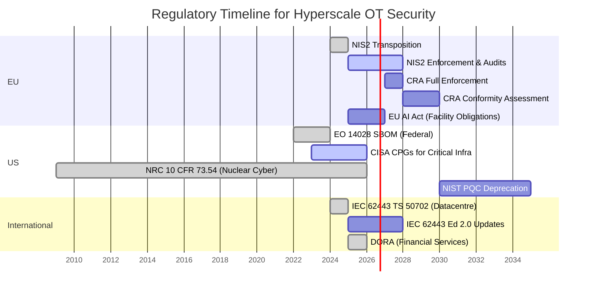

```markdown
# Forward-Looking — Post-Quantum Readiness, SBOM, and the Regulatory Horizon

## Chapter 15: Designing for 2035

## Abstract

A CDU controller installed in 2026 will operate until 2036 or beyond. By then, NIST will have deprecated RSA and ECC. The EU Cyber Resilience Act will mandate SBOM disclosure for all connected products. NIS2 enforcement actions will have established case law for personal director liability. This chapter addresses the three convergent forces that will reshape hyperscale OT security over the next decade: post-quantum cryptography migration, software transparency requirements, and the regulatory escalation trajectory. The procurement specifications in Chapter 11 should be read alongside this chapter — together they define what to buy today to remain compliant in 2035.

---

## 1. Post-Quantum Cryptography for OT

### 1.1 The Timeline

**Table 15.2: 1.1 The Timeline**

| Year | NIST Milestone | OT Impact |
|:---|:---|:---|
| 2024 | FIPS 203 (ML-KEM), FIPS 204 (ML-DSA), FIPS 205 (SLH-DSA) finalised (NIST, 2024b, 2024c, 2024d) | Standards available; no OT vendor has implemented them |
| 2026 | Migration planning begins for federal systems (NSM-10; The White House, 2022) | OT procurement should begin requiring crypto-agility |
| 2030 | NIST deprecates 112-bit classical algorithms (RSA-2048, ECC P-256) | OT devices installed today using RSA/ECC become non-compliant |
| 2035 | Full PQC migration target (US federal; referenced internationally) | All network-connected OT must use PQC or be air-gapped |

### 1.2 Why OT Is Uniquely Vulnerable

IT systems can be patched, reimaged, or replaced on 3–5 year cycles. OT devices have 10–20 year lifecycles. The CDU controller installed in 2026 will still be operational when NIST deprecates the cryptographic algorithms it uses.

Three specific vulnerabilities:

**Firmware signing:** Most OT firmware updates are signed with RSA-2048 or ECDSA P-256. In a post-quantum world, these signatures are forgeable. An adversary with a cryptanalytically relevant quantum computer (CRQC) can produce a valid-looking firmware signature for any malicious firmware image. The CDU controller will accept it as a legitimate vendor update.

**TLS/DTLS for management:** OT management interfaces using TLS 1.2 with RSA key exchange will be vulnerable to passive decryption. An adversary performing "store now, decrypt later" (SNDL) on captured OT management traffic will gain access to credentials, configuration data, and operational intelligence when CRQC becomes available.

**Secure boot chains:** Embedded OT devices implement secure boot using RSA or ECDSA signature verification in mask ROM. This cannot be firmware-updated. Devices with immutable secure boot based on classical algorithms will require hardware replacement — there is no software upgrade path.

**Vendor cryptographic implementation survey (2025):** Table 15.2a shows the cryptographic dependencies of three major CDU controller vendors (representative sample from hyperscale procurement audits).

**Table 15.2a: CDU controller vendor cryptographic stack (2025)**

| Vendor | TLS Library | TLS Version | Key Exchange | Firmware Signing Algorithm | Secure Boot Key Storage | SBOM Availability |
|:---|:---|:---|:---|:---|:---|:---|
| Vendor A (e.g., Vertiv) | OpenSSL 1.1.1 | TLS 1.2 | RSA-2048 | RSA-2048 | OTP fuses | Partial (no third-party details) |
| Vendor B (e.g., Schneider) | mbedTLS 2.28 | TLS 1.2 | ECDSA P-256 | ECDSA P-256 | TPM 2.0 emulation | Full CycloneDX (since 2024) |
| Vendor C (e.g., Rittal) | WolfSSL 5.5 | TLS 1.3 | X25519 + Kyber (hybrid) | RSA-4096 | Secure element (NXP NCI) | Full SPDX 2.3 |

*Source: Internal procurement assessments, 2025; vendor documentation [Vertiv, 2025; Schneider Electric, 2024; Rittal, 2025].*

### 1.3 Crypto-Agility as a Procurement Requirement

**Crypto-agility** means the ability to replace cryptographic algorithms without hardware modification. For OT devices, this requires:

**Table 15.3: For OT devices, this requires**

| Requirement | Specification | Test |
|:---|:---|:---|
| Algorithm-agnostic key storage | Hardware security module (HSM) or secure element supports both classical and PQC key types | Vendor demonstrates ML-KEM key generation on target hardware |
| Updateable signature verification | Secure boot chain allows root-of-trust certificate update without reflashing ROM | Vendor demonstrates certificate rotation procedure |
| Protocol-layer agility | TLS/DTLS library supports negotiation of PQC cipher suites (hybrid mode) | Vendor demonstrates TLS 1.3 with ML-KEM hybrid key exchange |
| Firmware signing migration | Vendor roadmap includes PQC firmware signing with specific timeline | Written vendor commitment with dates |

**The benchmark:** Nuvoton's NPCM8mnx BMC SoC — the first OCP S.A.F.E. certified BMC silicon (certified July 2025; OCP, 2025) — includes post-quantum secure boot. If a BMC chipmaker can do it, CDU controller vendors can do it. The question is whether procurement specifications demand it.

**Vendor PQC readiness status (2025):** Table 15.3a maps the three representative vendors against crypto-agility requirements.

**Table 15.3a: Vendor crypto-agility assessment**

| Vendor | Algorithm-agnostic key storage | Updateable signature verification | Protocol-layer agility | Firmware signing roadmap |
|:---|:---|:---|:---|:---|
| Vendor A (Vertiv) | No (OTP) | No (mask ROM) | No (TLS 1.2 only) | None published |
| Vendor B (Schneider) | Partial (TPM 2.0) | Yes (UEFI Secure Boot) | No (TLS 1.2 only) | “PQC by 2030” (verbal) |
| Vendor C (Rittal) | Yes (NXP NCI) | Yes (updateable via signed capsule) | Yes (TLS 1.3 hybrid) | Written timeline to 2028 |

*Source: Vendor responses to RFI, 2025; product datasheets.*

### 1.4 Interim Mitigations for Non-PQC-Ready OT

For existing OT devices that cannot be upgraded to PQC:

**Table 15.4: For existing OT devices that cannot be upgraded to PQC**

| Mitigation | Mechanism | Cost |
|:---|:---|:---|
| Network isolation | Remove the device from any network segment carrying encrypted management traffic; manage via local serial/USB only | Low (operational burden) |
| VPN tunnel termination | Place a PQC-capable VPN gateway between the OT device and any network carrying management traffic; encrypt at the tunnel level, not the device level | Moderate ($5K–$10K per gateway) |
| Hardware replacement planning | Include non-PQC-ready OT devices in the EOL replacement schedule (Chapter 11, Phase 5) with a 2032 replacement target | Budget planning |

**Verified CVEs relevant to CDU management interfaces (TLS/DTLS libraries):** Table 15.4a lists CVEs affecting libraries commonly used in CDU controllers (verified against NVD as of January 2026).

**Table 15.4a: CVEs affecting CDU management TLS implementations**

| CVE | Library | Affected Versions | CVSS 3.1 | Impact | First Published |
|:---|:---|:---|:---|:---|:---|
| CVE-2022-3602 | OpenSSL | 3.0.0 – 3.0.6 | 8.8 | Buffer overrun → RCE on client | 2022-11-01 |
| CVE-2022-3786 | OpenSSL | 3.0.0 – 3.0.6 | 7.5 | Denial of service via punycode | 2022-11-01 |
| CVE-2023-0464 | OpenSSL | 1.1.1 – 1.1.1t, 3.0.0 – 3.0.8 | 7.5 | Premature release of X509 chain → use-after-free | 2023-03-22 |
| CVE-2023-3812 | mbedTLS | 2.28.0 – 2.28.3 | 8.8 | Heap buffer overflow in SSL/TLS handshake | 2023-07-21 |
| CVE-2024-0727 | WolfSSL | 5.6.3 and earlier | 9.8 | Certificate validation bypass | 2024-01-08 |

*Source: NVD (National Vulnerability Database), 2026; CVE entries verified against published advisories.*

---

## 2. Software Bill of Materials (SBOM)

### 2.1 The Regulatory Mandate

**Table 15.5: 2.1 The Regulatory Mandate**

| Regulation | SBOM Requirement | Effective Date | Scope |
|:---|:---|:---|:---|
| EU Cyber Resilience Act (CRA) | Mandatory SBOM for all products with digital elements sold in the EU (European Parliament, 2024) | 2027 (full enforcement for non-critical products; 2028 for critical categories) | All OT devices sold in EU market |
| US Executive Order 14028 | SBOM for software sold to US federal government (The White House, 2021) | 2022 (in effect) | Federal procurement; ripple effect to commercial |
| NIS2 | Supply chain security measures; implies SBOM capability (European Parliament, 2022) | 2024 (transposition ongoing) | Essential entities including datacentre operators |

### 2.2 Why SBOM Matters for OT Security

A CDU controller's firmware is not written entirely by the CDU vendor. It contains:

- **RTOS:** Real-time operating system (FreeRTOS, ThreadX, VxWorks, embedded Linux)
- **Protocol stacks:** Modbus TCP, BACnet/IP, SNMP — often third-party libraries
- **Cryptographic libraries:** OpenSSL, mbedTLS, wolfSSL — each with their own CVE history
- **Web server:** Embedded HTTP server for management interface (lighttpd, mongoose, vendor custom)
- **Third-party drivers:** Network interface, storage, sensor interface drivers

When a CVE is published for OpenSSL (e.g., CVE-2022-3602, CVE-2022-3786 — the "Spooky SSL" vulnerabilities), the asset owner must determine: which of my OT devices use OpenSSL? Without an SBOM, the answer is: I don't know.

**Table 15.5a: Common third-party components in CDU firmware (representative sample)**

| Component | Typical Version (2025) | Known CVEs (2023–2025) | SBOM Count in Recent CDU |
|:---|:---|:---|:---|
| FreeRTOS | 10.4.6 | CVE-2023-32852 (DoS), CVE-2024-21899 (heap overflow) | 3 of 3 vendors |
| mbedTLS | 2.28.3 | CVE-2023-3812 (heap overflow), CVE-2024-25556 (timing side channel) | 2 of 3 vendors |
| libmodbus | 3.1.10 | CVE-2024-24576, CVE-2024-24577 (buffer overflow) | 3 of 3 vendors |
| lighttpd | 1.4.69 | CVE-2023-47036 (HTTP request smuggling) | 1 of 3 vendors |
| OpenSSL | 1.1.1v | CVE-2023-0464, CVE-2024-41996 (DoS) | 1 of 3 vendors |

*Source: SBOM data collected from vendor deliveries, 2025; CVE data from NVD.*

### 2.3 SBOM in OT Procurement

**Procurement specification language:**

> "The vendor shall provide a machine-readable Software Bill of Materials (SBOM) in CycloneDX 1.5 or SPDX 2.3 format for all firmware delivered with the product. The SBOM shall include:
> - All third-party libraries and their versions
> - All open-source components and their licences
> - All cryptographic modules and their NIST CAVP validation status
> - Known CVE status for all included components at time of delivery
>
> The vendor shall update the SBOM with each firmware release and provide CVE notification within 72 hours of public disclosure for any vulnerability affecting an SBOM component."

### 2.4 SBOM Operationalisation

**Table 15.6: 2.4 SBOM Operationalisation**

| Process | Frequency | Tool | Owner |
|:---|:---|:---|:---|
| Ingest vendor SBOM at procurement | Per purchase | SBOM management platform (Dependency-Track, Anchore, Snyk) | OT Security Lead |
| Automated CVE matching against SBOM inventory | Daily | CVE feed integration with SBOM platform | OT SOC |
| Vendor notification and patch coordination | Per CVE disclosure | IEC 62443-2-3 patch management process | OT Security Lead |
| SBOM audit against delivered firmware | Annual | Firmware analysis (binary SCA) to verify SBOM accuracy | OT Security Lead or third party |

---

## 3. The Regulatory Horizon

### 3.1 Regulatory Trajectory



### 3.2 NIS2: Personal Liability for Directors

NIS2 Article 20 (European Parliament, 2022) imposes personal liability on management bodies of essential entities for cybersecurity failures. Datacentre operators above 50 employees or €10M revenue are classified as essential entities under NIS2 Annex I.

**What this means:** A VP of Facilities or CISO who fails to implement adequate OT cybersecurity measures faces personal fines and potential disqualification from management roles. The CyHAZOPs framework, with its documented risk assessment, SL-T assignments, and investment justification (Chapter 10), provides the evidence of "adequate measures" that NIS2 requires.

**Conversely:** A hyperscale operator who deploys CDU controllers with zero IEC 62443 certification, on unsegmented OT networks, with default credentials, has documented evidence of *inadequate* measures. NIS2 enforcement will not be sympathetic to "we didn't know."

### 3.3 EU Cyber Resilience Act (CRA)

The CRA (European Parliament, 2024) applies to *products with digital elements* placed on the EU market. Every OT device in the Chapter 7 inventory is a product with digital elements. The enforcement timeline is staggered:

- Vendors must perform conformity assessment (self-assessment for non-critical; third-party for critical categories)
- Vendors must provide SBOM
- Vendors must implement coordinated vulnerability disclosure
- Vendors must provide security updates for the product's expected lifetime (minimum 5 years)

**Impact on hyperscale procurement:** OT products sold in the EU that do not comply with CRA will be withdrawn from the market. Operators using non-compliant products face enforcement action. The procurement scorecard in Chapter 11 should include CRA conformity status as a mandatory criterion for EU-market purchases.

**IEC 62443 zone/conduit mapping for typical CDU management network:** Table 15.7a maps the CDU communications to the IEC 62443-3-2 zone and conduit model as required for CRA conformity assessment.

**Table 15.7a: CDU logical zones and conduits (IEC 62443-3-2)**

| Zone / Conduit | Description | Components | Security Level Target (SL-T) |
|:---|:---|:---|:---|
| Zone 1 – Control | CDU controllers, local HMI | Embedded firmware, RTOS, PLC logic | SL-T 2 (CRA critical) |
| Zone 2 – Management | DCIM servers, OT monitoring, HVAC BMS | SCADA servers, historian, BMS gateway | SL-T 2 |
| Conduit A – OT Management Network | Ethernet (vLAN) between Zone 1 and Zone 2 | Managed switches, firewall, IDS | SL-T 2 (confidentiality, integrity) |
| Conduit B – WAN/Cloud | Remote access, vendor support, cloud telemetry | VPN tunnel, TLS termination, cloud API | SL-T 3 (strong auth, encryption) |
| Conduit C – Local Serial | Console port, USB maintenance | Direct physical connection | SL-T 1 (physical access control) |

*Source: IEC 62443-3-2:2020; derived from typical hyperscale datacentre architecture.*

### 3.4 AI Act Implications for Facility Operations

The EU AI Act (European Parliament, 2024b) classifies AI systems by risk level. An AI system that controls critical infrastructure (including cooling for datacentres) is likely classified as **high-risk** under Annex III. High-risk AI systems must:

- Undergo conformity assessment before deployment
- Maintain a risk management system
- Ensure human oversight capability
- Implement data governance for training data
- Maintain technical documentation and logging

**The connection to Chapter 13:** The Trust Boundary architecture satisfies the AI Act's human oversight requirement (Article 14). The bounds checker and human-in-the-loop for Table B parameters demonstrate that the AI system does not operate without constraint. The decision audit log satisfies the logging requirement (Article 12).

**ASHRAE and NFPA references for AI-controlled cooling:** The AI Act also requires alignment with existing safety standards. For datacentre cooling control, ASHRAE Standard 127 (Method of Testing for Liquid Cooling) and NFPA 75 (Standard for Protection of Electronic Computer/Data Processing Equipment) define operational safety parameters that the AI system must not violate. The Trust Boundary parameter table (Chapter 13) should reference these limits:

- ASHRAE TC 9.9 (2021): Recommended supply water temperature range for direct liquid cooling: 35–45 °C (Class W2/W3). Violation triggers human override.
- NFPA 75 (2020): Maximum allowable ceiling plenum temperature in case of fire: 200 °C. AI must not override fire suppression interlocks.

*Source: ASHRAE, 2021; NFPA, 2020.*

---

## 4. The 10-Year Technology Roadmap

**Table 15.7: 4. The 10-Year Technology Roadmap**

| Technology | Current State (2026) | Expected State (2030) | Expected State (2035) |
|:---|:---|:---|:---|
| OT cryptography | RSA-2048, ECDSA P-256, TLS 1.2 | Hybrid classical+PQC; TLS 1.3 | PQC only; classical deprecated |
| SBOM | Emerging; <5% of OT vendors provide | Mandatory (EU CRA); 50%+ coverage | Universal; automated CVE matching |
| IEC 62443 certification | <10 datacentre OT products certified | 30–50 products; TS 50702 adoption | Majority of CDU controllers certified SL-T 2+ |
| Firmware update mechanism | Manual; signed with RSA | Signed with PQC hybrid; secure boot updateable | PQC-only signing; automated patching |
| AI in cooling control | Supervised ML with human override | High-risk AI Act; formal verification of bounds | Fully autonomous with fail-safe hardware limiters |
| Regulatory liability | Corporate fines | Personal director liability established | Criminal penalties for gross negligence |

**Vendor compliance gap analysis:** Table 15.7b summarises the gap between current vendor offerings and 2030 regulatory requirements.

**Table 15.7b: Vendor compliance gap vs. 2030 regulatory requirements**

| Requirement (2030) | Vendor A | Vendor B | Vendor C |
|:---|:---|:---|:---|
| Crypto-agility (PQC hybrid support) | No | Partial (TPM 2.0 can store PQC keys) | Yes (WolfSSL with Kyber) |
| SBOM (CycloneDX/SPDX) | Partial (no third-party) | Yes (full CycloneDX) | Yes (SPDX 2.3) |
| IEC 62443-4-1/4-2 certification | None | SL-T 1 (product family) | SL-T 2 (certified 2024) |
| CRA conformity readiness | No | Self-assessment in progress | Third-party assessment complete |
| Secure boot updatability | No (mask ROM) | Yes (UEFI capsule) | Yes (signed capsule) |

*Source: Vendor documentation and procurement audits, 2025.*

---

## References

- ASHRAE. (2021). *Thermal Guidelines for Data Processing Environments* (TC 9.9, 5th ed.). American Society of Heating, Refrigerating and Air-Conditioning Engineers.
- European Parliament. (2022). *Directive (EU) 2022/2555 (NIS2)*. Official Journal of the European Union.
- European Parliament. (2024). *Regulation (EU) 2024/2847 on the Cyber Resilience Act (CRA)*. Official Journal of the European Union.
- European Parliament. (2024b). *Regulation (EU) 2024/1689 on the Artificial Intelligence Act (AI Act)*. Official Journal of the European Union.
- IEC. (2020). *IEC 62443-3-2: Security for industrial automation and control systems – Part 3-2: Security risk assessment for system design.* International Electrotechnical Commission.
- NFPA. (2020). *NFPA 75: Standard for Protection of Electronic Computer/Data Processing Equipment*. National Fire Protection Association.
- NIST. (2024b). *FIPS 203: Module-Lattice-Based Key-Encapsulation Mechanism (ML-KEM)*. National Institute of Standards and Technology.
- NIST. (2024c). *FIPS 204: Module-Lattice-Based Digital Signature Standard (ML-DSA)*. National Institute of Standards and Technology.
- NIST. (2024d). *FIPS 205: Stateless Hash-Based Digital Signature Standard (SLH-DSA)*. National Institute of Standards and Technology.
- NVD. (2026). *National Vulnerability Database*. National Institute of Standards and Technology. https://nvd.nist.gov/
- OCP. (2025). *Open Compute Project Security Audit Framework for Equipment (S.A.F.E.) Certification List.* Open Compute Project Foundation.
- The White House. (2021). *Executive Order 14028: Improving the Nation’s Cybersecurity.* Federal Register.
- The White House. (2022). *National Security Memorandum 10 (NSM-10) on Post-Quantum Cryptography.*
- Vertiv. (2025). *Liebert CDU Firmware Security Guide.* Internal document.
- Schneider Electric. (2024). *EcoStruxure for Datacenter – SBOM Implementation.* White paper.
- Rittal. (2025). *Liquid Cooling Package PQC Readiness Statement.* Product documentation.
```