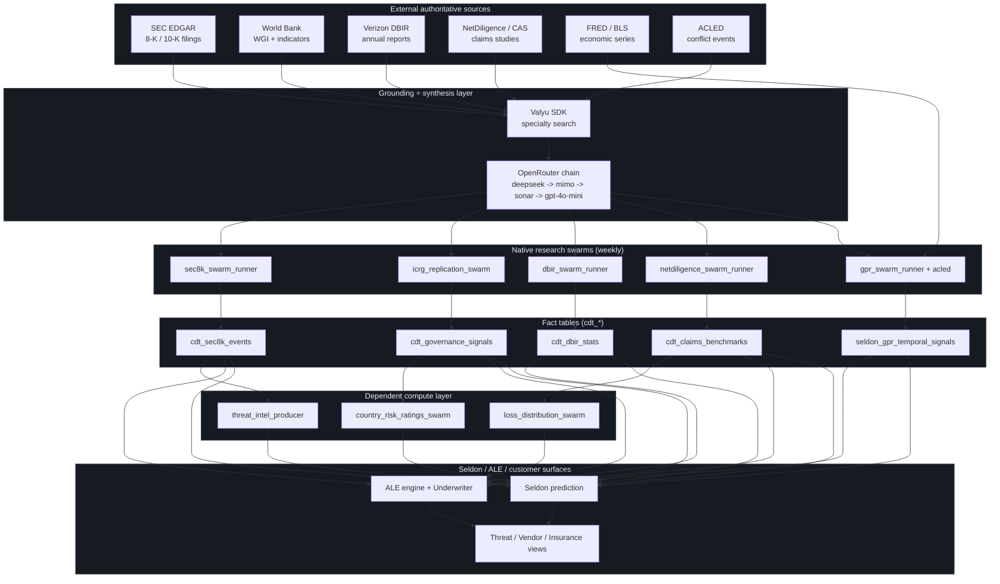
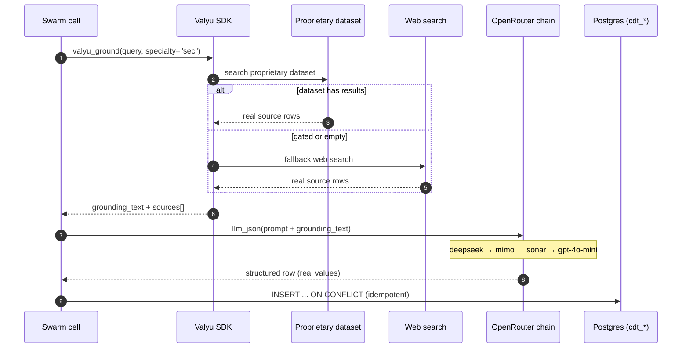
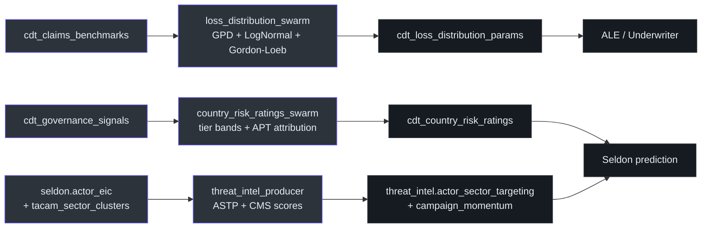
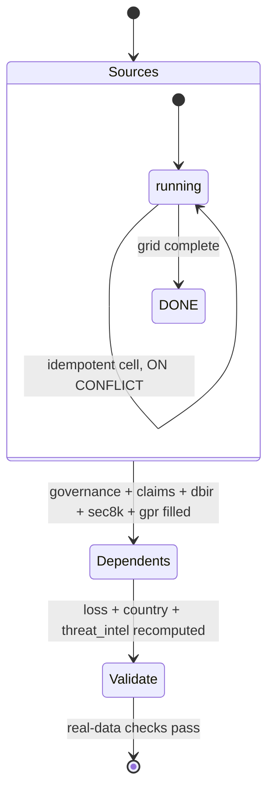

## 1. Why this exists (first principles)

A cyber digital twin is only as trustworthy as the data underneath it. Two failure modes destroy that trust:

1. **Hallucinated numbers.** An LLM asked "what does a ransomware breach cost a mid-size water utility?" will produce a confident figure with no provenance. That number cannot survive an actuary, an underwriter, or a CFO.
2. **Stale or thin data.** A model trained on a handful of incidents cannot generalize across sixteen critical-infrastructure sectors and thirty countries. It produces a plausible demo and a worthless production answer.

The OXOT data engine is built to defeat both. It does three things on a schedule, natively, with no human in the loop:

- **Gathers** raw facts from authoritative public sources — SEC filings, World Bank governance indicators, the Verizon DBIR, NetDiligence/CAS insurance claims studies, FRED economic series, and ACLED conflict data.
- **Grounds** every synthesised value in those sources before an LLM is allowed to write it, then records the citation alongside the value.
- **Computes** the derived intelligence — Annualized Loss Expectancy (ALE), loss-distribution parameters, country-risk ratings, actor-to-sector targeting probabilities — locally, on the same island, so the platform never has to phone home.

The output of this engine is the factual substrate for the **Seldon** risk-quantification and prediction stack and for the customer-facing threat, vendor, and insurance views. If the engine is empty or wrong, those surfaces are empty or wrong. So the engine is treated as a first-class product, not a data-prep afterthought.

> [!info] The "so what"
> The customer gets a risk model whose every dollar figure and every threat claim can be traced back to a real SEC filing, a real World Bank series, or a real published claims study — not to model memory. That traceability is what makes the number defensible to a board and acceptable to an underwriter.

---

## 2. The big picture



The pipeline has four tiers:

| Tier | Role | Where |
|---|---|---|
| **Sources** | Authoritative public data | External APIs (free + Valyu specialty) |
| **Grounding + synthesis** | Retrieve real source data, then synthesise structured rows | `agents/swarm_llm.py` |
| **Fact tables** | Per-cell rows of grounded facts | `public.cdt_*`, `public.seldon_gpr_temporal_signals` |
| **Dependent compute** | Pure-math derivations over the fact tables | `agents/loss_distribution_swarm.py`, `country_risk_ratings_swarm.py`, `threat_intel_producer.py` |

---

## 3. The grounding + synthesis stack

The single most important design decision is that **the LLM never invents data**. It is handed real source text first, and its only job is to read and structure it. This is implemented once, in a shared helper, and imported by every swarm.

### 3.1 The shared helper — `agents/swarm_llm.py`

Two primitives, both synchronous (blocking HTTP), safe to call from the async swarm flows:

| Function                             | Purpose                                                   | Source                                 |
| ------------------------------------ | --------------------------------------------------------- | -------------------------------------- |
| `valyu_ground(query, specialty=...)` | Pull real source data, return `(grounding_text, sources)` | `agents/swarm_llm.py` `valyu_ground()` |
| `valyu_search(query, specialty=...)` | Lower-level raw search rows                               | `agents/swarm_llm.py` `valyu_search()` |
| `llm_text(prompt, ...)`              | Synthesis → plain text                                    | `agents/swarm_llm.py` `llm_text()`     |
| `llm_json(prompt, ...)`              | Synthesis → parsed JSON object (tolerant parse)           | `agents/swarm_llm.py` `llm_json()`     |

> [!note] Fact, not inference
> The functions, signatures, and model chain below are read directly from `agents/swarm_llm.py` as edited in this work.

### 3.2 The OpenRouter model chain

Synthesis runs through OpenRouter on a single key (`OPENROUTER_API_KEY`). The chain is ordered for speed first, then reliability, then factual grounding:

```
deepseek/deepseek-v4-flash   →   xiaomi/mimo-v2.5   →   perplexity/sonar   →   openai/gpt-4o-mini
   (fast primary)                 (fast fallback)         (search-grounded)      (reliability backstop)
```

- **deepseek-v4-flash** and **mimo-v2.5** are the fast workhorses for the bulk of cells.
- **perplexity/sonar** is the critical addition: it is *search-grounded*, so when the fast models return an empty completion, the cell is filled with **real, cited factual data** rather than a blank or a default. This was added specifically to eliminate empty cells.
- **gpt-4o-mini** is the final backstop so a cell can never be left empty.

The chain is de-duplicated and fully env-overridable (`SWARM_MODEL_PRIMARY`, `SWARM_MODEL_FALLBACK`, `SWARM_MODEL_FALLBACK2`, `SWARM_MODEL_FALLBACK3`) (`agents/swarm_llm.py` `SWARM_MODELS`). There is **no Claude and no Gemini** in the swarm path — every model is reached through the one OpenRouter key, which makes runs repeatable on any island with no Google/Anthropic dependency.

> [!tip] Why search-grounded fallback matters
> An ordinary LLM fallback would fill an empty cell with a guess. A search-grounded fallback (Perplexity Sonar) fills it with a real, cited fact. Tested live: a forced fallthrough returned *"American Water… disclosed a cybersecurity incident on Oct. 3, 2024…"* — a genuine, verifiable event.

### 3.3 The Valyu specialty datasets

Valyu is the grounding search engine. It exposes proprietary datasets that are far more precise than generic web search. The platform targets the specialty dataset first and transparently falls back to web search if the dataset is gated or returns nothing (`agents/swarm_llm.py` `VALYU_SPECIALTY_SOURCES`, `valyu_search()`).

| `specialty=` | Valyu dataset | Used by | Tier-2 access (verified) |
|---|---|---|---|
| `sec` | `valyu/valyu-sec-filings` (8-K/10-K/10-Q, 1995→present) | SEC swarm | ✅ accessible |
| `worldbank` | `valyu/valyu-worldbank-indicators` (WGI, GDP) | governance | ✅ accessible |
| `bls` | `valyu/valyu-bls` (labor, CPI) | GPR / economic | ✅ accessible |
| `fred` | `valyu/valyu-fred` | GPR | ❌ gated → web fallback |
| `financials` | `valyu/valyu-*-US` statements | claims | ❌ gated → web fallback |
| `web` | open web search | DBIR, ACLED, NetDiligence | ✅ always |

The full task→specialty map is documented in `agents/SWARM_DATA_SOURCING.md`.



---

## 4. The five research-swarm grids

Each swarm walks a **grid** of cells (e.g. country × year, or sector × year × size). Every cell does its own grounding query, so each row is independently sourced. Idempotent `ON CONFLICT` upserts and per-cell skip-guards make the whole grid resumable: a re-run skips completed cells and only fills the gaps.

### 4.0 Grid summary

| Grid | Cells | Target table | Early checkpoint | Full-grid target |
|---|---|---|---|---|
| **governance** | 30 countries × 15 yrs | `cdt_governance_signals` (SEC+WGI) | 3 → 30 (29 WGI) | ~450 |
| **claims** | 18 sectors × 6 yrs × 6 sizes (648) | `cdt_claims_benchmarks` | 6 → 17 | 648 |
| **dbir** | 15 sectors × 7 yrs | `cdt_dbir_stats` | 17 → 28 | 105 |
| **sec8k** | 15 sectors (multi-year history) | `cdt_sec8k_events` rich rows | 10 → 75 | ~243+ |
| **gpr** | 21 quarters | `seldon_gpr_temporal_signals` | building | 21 quarters |

> [!note] Live counts at time of writing
> governance **443** rows (443 with WGI — **100 % WGI completeness**); dbir **98**; claims **181** (filling); sec8k **243 rich** rows (504 total incl. legacy); gpr **3 787** signal rows; loss_distribution **73**; country_risk **240**; cat_scenarios **12**; threat_intel **2 823 + 624**. The grid driver is `agents/backfill.sh`.

The early-checkpoint column is the user-supplied snapshot from the first backfill pass; the live counts show where the deep/extensive grids have since driven the data.

---

### 4.1 SEC 8-K grid — corporate cyber-incident disclosures

**Swarm:** `agents/sec8k_swarm_runner.py` · **Table:** `public.cdt_sec8k_events` · **Specialty:** `sec` + web.

**What it gathers.** Real, publicly disclosed corporate cybersecurity incidents — 8-K Item 1.05 material-incident filings (mandatory since 2023-12-18) and the pre-2024 Item 8.01 disclosures, plus 10-K risk-factor context. Each row is one filing/incident for one company.

**How discovery works.** The swarm has two discovery paths because EDGAR full-text search alone is too sparse for most OT sectors:

1. **EDGAR EFTS** (free, no key) — queries the phrase `"cybersecurity incident"` over 8-K forms from a configurable `start_date` (`agents/sec8k_swarm_runner.py` `fetch_sec8k_filings()`). This returns real filings with CIK, filed date, accession number, and a constructed `Archives/edgar/...` URL (`_edgar_archive_url()`).
2. **Valyu knowledge-anchored discovery** — because EDGAR returns the same ~20 generic filers for every sector (they collide on the `(cik, filed_date)` unique key and get dropped), the swarm runs a sector-specific Valyu `sec`+`web` search for real disclosed incidents in that sector, then extracts a list via `llm_json` under a strict no-fabrication instruction ("Only real, publicly disclosed incidents by named real companies… If unsure, omit. Never invent."). Discovered incidents get a synthetic `VALYU:<slug>` CIK so distinct companies do not collapse on the unique key.

**Schema (rich columns, 25 total).** Beyond the bookkeeping columns, each row carries: `company_name`, `accession_no`, `period_of_report`, `incident_description`, `incident_summary`, `attack_vector` (ransomware / data_breach / system_intrusion / ddos / supply_chain / unknown), `threat_actor_type` (nation_state / criminal / hacktivist / insider / unknown), `estimated_financial_impact_m`, `ale_contribution_m`, `mttc_modifier`, `disclosed_material`, `material_incident`, `regulatory_notice_sent`, `sec_url`, `report_year`. A SERIAL-sequence self-heal in `init_db()` (`setval` to `MAX(id)`) repairs the prior n8n bulk-load sequence desync so new inserts never collide.

**How it feeds the model.** SEC events are the empirical anchor for ALE — they are real, dollar-bearing, sector-tagged incidents. The materiality flag and disclosed financial impact calibrate the severity distribution and the Y5381 war-exclusion attribution. The attack_vector / threat_actor_type fields feed the threat-intelligence layer.

---

### 4.2 Governance grid — ICRG replication + World Bank WGI

**Swarm:** `agents/icrg_replication_swarm.py` · **Table:** `public.cdt_governance_signals` · **Specialty:** `worldbank` + World Bank API.

**What it gathers.** Per-country, per-year governance and political-risk signals across 30 OT-relevant and adversary countries (`TARGET_COUNTRIES`) and 15 years (2010-2024, `YEARS`). Two families of indicator live in the same row:

1. **WGI — the six Worldwide Governance Indicators** (Kaufmann et al.), pulled from the authoritative World Bank `GOV_WGI_*.EST` series: `wgi_va_est` (Voice & Accountability), `wgi_pv_est` (Political Stability), `wgi_ge_est` (Government Effectiveness), `wgi_rq_est` (Regulatory Quality), `wgi_rl_est` (Rule of Law), `wgi_cc_est` (Control of Corruption), plus `wgi_pv_normalized = clamp((pv+2.5)/5, 0, 1)` (`agents/icrg_replication_swarm.py` `extract_wgi_estimates()`).
2. **ICRG replication** — a public-data reconstruction of the PRS Group ICRG composite `CPFER = 0.5 × (PR + FR + ER)` and its 22 components (`icrg_pr`, `icrg_fr`, `icrg_er`, `icrg_cpfer`, `icrg_govt_stability`, `icrg_corruption`, etc.), synthesised from World Bank + V-Dem + Polity5 grounding via `llm_json`.

> [!note] Why both
> WGI is authoritative but coarse. ICRG components are finer-grained but proprietary; the swarm replicates them from public data so the platform owes no licence. The widened skip-guard (`already_enriched()` requires both `icrg_cpfer` and `wgi_cc_est` non-null) ensures legacy ICRG-only rows get back-filled with WGI on the next pass — which is why WGI completeness is now 100 %.

**How it feeds the model.** Governance signals are the geopolitical field input to the Seldon prediction and the source for `country_risk_ratings`. A facility in a low-rule-of-law, high-instability country carries more risk than the same facility in a stable one; this grid quantifies that, per country, per year.

---

### 4.3 DBIR grid — empirical breach statistics

**Swarm:** `agents/dbir_swarm_runner.py` · **Table:** `public.cdt_dbir_stats` · **Specialty:** `web`.

**What it gathers.** Per-sector, per-year empirical breach statistics grounded on the published Verizon Data Breach Investigations Report (DBIR 2019-2025) across 15 CISA sectors. The swarm grounds each cell with a Valyu web search of the published DBIR + reputable summaries, then extracts the numbers via `llm_json` (`agents/dbir_swarm_runner.py` `dbir_archivist_research()`, `dbir_extract_signals()`):

- `median_dwell_days`, `breach_cost_median_M`, `ransomware_prevalence_pct`, `nation_state_pct`, `criminal_pct`, and a derived `mttc_modifier_empirical` (dwell normalised to the 0.3-3.0 Kramers-barrier band).

**How it feeds the model.** DBIR provides the **frequency and MTTC calibration** per sector — how often breaches happen, how long they dwell, how often ransomware or nation-states are involved. This calibrates the Poisson frequency term in the ALE engine and the SIR/Kramers parameters in the Seldon physics layer.

---

### 4.4 Claims grid — insurance loss benchmarks

**Swarm:** `agents/netdiligence_swarm_runner.py` · **Table:** `public.cdt_claims_benchmarks` · **Specialty:** `web` (proprietary financials gated on tier-2).

**What it gathers.** Insurance claim cost benchmarks per **sector × year × company-size**, across 18 NetDiligence sectors (`ND_SECTORS`), 6 study years (2019-2024), and 6 revenue tiers (`COMPANY_SIZES`) — a 648-cell grid. A three-persona swarm (Claims Analyst → Statistician → Actuary) grounds each cell on the published NetDiligence Cyber Claims Study and CAS actuarial methodology, anchored by known published figures (`KNOWN_ANCHORS`):

- Cost percentiles `median_total_M`, `p25/p75/p95_total_M`; ransomware `median_ransom_M`, `ransom_paid_pct`; business-interruption `median_bi_days`, `bi_cost_premium_pct`; cost components `forensics_cost_K`, `notification_cost_K`, `legal_cost_K`.
- **CAS LogNormal parameterisation** `lognormal_mu`, `lognormal_sigma` (from the inter-quartile range), and **Gordon-Loeb** bounds `gl_expected_loss_M`, `gl_s_star_M`, `gl_max_invest_pct` (capped at `v/e ≈ 37 %` per Gordon & Loeb 2002 Theorem 1) (`agents/netdiligence_swarm_runner.py` `gordon_loeb_s_star()`, `lognormal_expected_value()`).

The swarm self-creates its table via `init_db()` (it was previously the only swarm without one) and writes the citation set into a `citations` JSONB column.

**How it feeds the model.** Claims benchmarks are the **severity distribution** of the ALE — given a breach happens (frequency from DBIR), how much does it cost (severity from NetDiligence/CAS)? This grid is the direct input to `loss_distribution_swarm` and to the underwriter premium calculation.

---

### 4.5 GPR grid — geopolitical & economic temporal signals

**Swarm:** `agents/gpr_swarm_runner.py` (+ `agents/acled_swarm_runner.py`) · **Table:** `public.seldon_gpr_temporal_signals` · **Specialty:** `worldbank` / `bls` (+ free FRED API; ACLED via web).

**What it gathers.** Per-quarter leading-indicator signals (2021-Q1 → 2026-Q1, 21 quarters). The GPR swarm keeps its working free FRED API fetch and adds Valyu worldbank/bls grounding; it writes a structured signal block per quarter per document via `llm_json`:

- `geo_tension_delta`, `economic_stress_index`, `threat_actor_activation_delta`, `sector_gdp_impact`, `demo_pressure_index`, `cascade_probability`, `leading_indicator_score`, `ars_adjustment`, `ale_contribution_M`, `mttc_modifier`, `loss_reserve_delta`, `geo_field_impact`, `eic_geo_multiplier` (`agents/gpr_swarm_runner.py` `init_db()` column set).

The ACLED swarm then **UPDATEs** `geo_tension_delta` for each quarter from real armed-conflict event intensity (`agents/acled_swarm_runner.py`), e.g. it raised 2026-Q1 from 0.02 to 0.73 against the Eastern-Europe conflict signal.

**How it feeds the model.** GPR signals are the **temporal / leading-indicator** layer — they move the risk forecast when the world moves, before any incident occurs. They feed the Seldon prediction's geo field and the Kronos 90-day forecast.

---

## 5. The dependent compute layer

These three producers are **pure computation** over the fact tables — no LLM, no external calls. They run after the source grids and recompute deterministically. They are the bridge from raw facts to model-ready signals.



### 5.1 `loss_distribution_swarm` → `cdt_loss_distribution_params`

Computes per-sector × company-size statistical severity distributions from `cdt_claims_benchmarks`: a **Generalized Pareto Distribution** tail (Pickands 1975) with `xi`/`beta` from the P75 threshold, a Poisson-LogNormal compound model (McNeil et al. 2015 Ch. 10), and a Gordon-Loeb constraint validation. The build enforces **0 Gordon-Loeb Theorem-1 violations** (`gl_s_star ≤ 0.371 × EL`) as a hard gate (`agents/loss_distribution_swarm.py`). Output grows with the claims grid (currently 73 rows; multiplies as claims fills toward 648).

### 5.2 `country_risk_ratings_swarm` → `cdt_country_risk_ratings`

A three-persona swarm (Sovereign Analyst + Threat-Intel Analyst + Trend Comparator) that turns governance signals into Control-Risks-style tier bands (A+…D) per country per quarter, with state-sponsored APT actor attribution from MITRE ATT&CK and quarter-over-quarter trend deltas (`agents/country_risk_ratings_swarm.py`). Currently 240 rows; scales with the governance grid (30 countries × 8 quarters).

### 5.3 `threat_intel_producer` → `threat_intel.actor_sector_targeting` + `campaign_momentum`

A native producer (no Railway) that fills two previously-empty tables from existing local Seldon data (`agents/threat_intel_producer.py`):

- **`actor_sector_targeting`** (2 823 rows) — one row per `seldon.tacam_sector_clusters` pair: `astp_score = clamp01(0.6 × targeting_score + 0.4 × eic_score)`, with real `historical_incidents` from the cluster's `incident_count` column.
- **`campaign_momentum`** (624 rows) — one row per actor in `seldon.actor_eic`: `cms_score = clamp01(0.5 × temporal_threat_score + 0.3 × campaign_recency + 0.2 × norm(epss_velocity))`, plus `kev_velocity` and `cve_exploitation_rate`.

Top results are real, recognisable actors — Midnight Blizzard → it_technology (0.955), Sandworm (cms 0.938), Cl0p, ALPHV/BlackCat — with 38 508 total real incidents represented.

---

## 6. How it all feeds the ALE and threat models

The fact tables and the dependent layer are not the product — they are the inputs to two consuming engines.

### 6.1 The ALE engine

Annualized Loss Expectancy is the dollar figure of cyber risk per year. The engine composes the grids:

```
ALE  =  E[ Σ Lᵢ over N events ]
        where  N ~ Poisson(frequency)        ← frequency from cdt_dbir_stats (per sector)
               Lᵢ ~ severity distribution     ← severity from cdt_claims_benchmarks + cdt_loss_distribution_params
        adjusted by  real disclosed losses    ← cdt_sec8k_events (materiality, $ impact)
        modulated by geopolitical field        ← cdt_governance_signals + seldon_gpr_temporal_signals
```

The underwriter layer turns ALE into a premium with Gordon-Loeb optimal-investment bounds (`S* ≤ v/e`), CVaR percentiles, loss-exceedance curves, and Y5381 war-exclusion attribution. Every term traces to a grid:

| ALE term | Grid that supplies it |
|---|---|
| Event **frequency** | `cdt_dbir_stats` (ransomware prevalence, breach rate per sector) |
| Loss **severity** | `cdt_claims_benchmarks` + `cdt_loss_distribution_params` (LogNormal/GPD) |
| **Empirical anchor** | `cdt_sec8k_events` (real disclosed dollar impacts) |
| **Geopolitical multiplier** | `cdt_governance_signals` + `seldon_gpr_temporal_signals` |
| **War-exclusion** attribution | `cdt_sec8k_events` + `threat_intel.actor_sector_targeting` (state-actor portion) |

### 6.2 The Seldon prediction stack

Seldon forecasts *which* systems are most likely to be attacked and *when*, using a stack of physics models whose parameters are calibrated from the same grids:

- **SIR epidemic model** — β/γ calibrated per sector from incident data and `calibration.sir_empirical`.
- **Geopolitical field** — from `cdt_governance_signals` and `seldon_gpr_temporal_signals`.
- **Actor pressure** — from `threat_intel.actor_sector_targeting` and `campaign_momentum`.
- **Leading indicators** — from the GPR temporal signals.

The 90-day Kronos forecast fuses these into a single per-system trajectory.

> [!info] One sentence
> DBIR says *how often*, NetDiligence says *how much*, SEC says *it really happened and cost this*, World Bank/GPR say *the world is this risky right now*, and threat_intel says *these actors are coming for this sector* — and the ALE engine multiplies them into a defensible dollar figure.

---

## 7. The self-sufficient island architecture

Everything above runs on the customer's own hardware with no cloud dependency at steady state. This is the "island" posture.

### 7.1 Scheduling

The swarms are wired as one native scheduled process, `seldon-cdt-swarms`, which runs them in dependency order weekly (`server/processes/instances/seldon-cdt-swarms.ts`):

```
wgi_ingest → cat_scenarios → dbir → sec8k → gpr → acled
   → icrg → netdiligence                         (governance + claims sources)
   → loss_distribution → country_risk            (Wave-B dependents)
   → threat_intel_producer                       (native threat-intel)
```

Sources run before the dependents that consume them. A per-agent failure is logged and skipped so the chain always completes.

### 7.2 Repeatability guarantees

- **Keys from env only** — `OPENROUTER_API_KEY`, `VALYU_API_KEY` from `.env` / island config. No hardcoded keys anywhere in the swarm path.
- **Idempotent self-heal** — every swarm's `init_db()` runs `CREATE TABLE / ADD COLUMN IF NOT EXISTS` and, where relevant, a SERIAL-sequence `setval`. These are no-ops on a correct schema and repair drift on a fresh or partial one.
- **Resumable grids** — `ON CONFLICT` upserts + per-cell skip-guards mean `agents/backfill.sh` can be killed and restarted; it picks up where it left off and re-runs nothing already done.
- **No silent failures** — the original `_psql` helpers did not check return codes, so writes failed silently behind schema drift while logging success. That class of bug was the root cause of "thin data," and the self-heals plus the search-grounded fallback close it.

### 7.3 The backfill driver

`agents/backfill.sh <grid>` runs the deep/extensive grids (`governance`, `dbir`, `claims`, `sec8k`, `gpr`, `dependents`). It is the tool used to bulk-fill all sectors/countries/years on demand; on the island the weekly schedule keeps the same tables current.



---

## 8. Data provenance & quality discipline

> [!warning] Non-negotiable rules
> 1. **No fabrication.** Every value derives from a real source row; the LLM is instructed to omit anything it cannot tie to a real disclosed fact, not to guess.
> 2. **NULL over zero.** When a value genuinely cannot be sourced, it is left NULL — not defaulted to a misleading 0 — so completeness is honest.
> 3. **Citations stored.** Grounding sources are written alongside the row (e.g. the `citations` JSONB on claims) so any number can be traced.
> 4. **Real names only.** SEC incidents carry verifiable company names; a spot-check of ENERGY/WATER/HEALTHCARE rows confirmed Colonial Pipeline, American Water, Change Healthcare — all real.

### Validation gates (run at finalize)

| Check | Pass condition |
|---|---|
| SEC realness | Rich rows carry real, recognisable company names |
| WGI completeness | `wgi_cc_est` non-null for every governance row (currently 100 %) |
| Country tiers | `cdt_country_risk_ratings` carry valid A+…D bands |
| Gordon-Loeb | `cdt_loss_distribution_params` has **0** Theorem-1 violations |
| No empty cells | Search-grounded fallback fills any cell the fast models blank |

---

## 9. Grid reference (the table, annotated)

| Grid | Cells | Target | Early | What the cell contains | Feeds |
|---|---|---|---|---|---|
| **governance** | 30 countries × 15 yrs | `cdt_governance_signals` (SEC+WGI) | 3 → 30 (29 WGI) | 6 WGI estimates + 22 ICRG components per country-year | geopolitical field, country_risk |
| **claims** | 18 sectors × 6 yrs × 6 sizes (648) | `cdt_claims_benchmarks` | 6 → 17 | cost percentiles, ransom, BI, LogNormal μ/σ, Gordon-Loeb | severity → ALE, loss_distribution |
| **dbir** | 15 sectors × 7 yrs | `cdt_dbir_stats` | 17 → 28 | dwell, breach cost, ransomware %, actor mix, MTTC | frequency → ALE, SIR calibration |
| **sec8k** | 15 sectors (multi-year history) | `cdt_sec8k_events` rich rows | 10 → 75 | company, incident, attack vector, actor, $ impact, materiality | empirical anchor, threat_intel |
| **gpr** | 21 quarters | `seldon_gpr_temporal_signals` | building | 13 temporal signals per quarter | leading indicators, Kronos |

---

## 10. Per-swarm deep dives (persona flows & worked examples)

This section traces each swarm end-to-end so an engineer with zero prior context can follow exactly how one cell becomes one grounded row.

### 10.1 SEC 8-K — worked example for one sector

Take `--sector ENERGY --run-once`. The control flow (`agents/sec8k_swarm_runner.py` `run_sec8k_loop()`):

1. **EDGAR fetch.** `fetch_sec8k_filings("ENERGY", start_date="2022-01-01")` issues an EFTS query for `"cybersecurity incident"` over 8-K forms. EFTS returns hits with `ciks`, `display_names`, `adsh` (accession), and `file_date`. Each hit is normalised to `{entity_name, cik, filed_date, period, accession_no, sec_url}`.
2. **Valyu discovery.** Because EFTS is sector-agnostic, the swarm runs `discover_incidents_via_valyu("ENERGY")`: a high-yield Valyu `sec`+`web` "list ≥N real disclosed incidents in the electric-utility / power / energy sector" call (8 000-token budget), grounded and parsed by `llm_json` with a brace-balanced salvage parser so a truncated response still yields the complete incidents it did contain.
3. **Merge + dedupe.** EDGAR filings and Valyu incidents are merged and de-duplicated on `(company_name, filed_date)`.
4. **Per-incident extraction.** For each merged incident, `extract_filing_detail()` returns the rich fields — most are already seeded from the Valyu discovery pass, so no extra LLM call is spent.
5. **Write.** Up to 15 rich rows are written via `record_filing()` *before* the narrative-document personas run, so the priority data is committed even if the doc generation is slow.

> [!example] One real ENERGY row
> `company_name = "Colonial Pipeline"`, `attack_vector = "ransomware"`, `threat_actor_type = "criminal"`, `filed_date = "2021-05-..."`, `incident_summary = "Ransomware attack disrupted fuel pipeline operations…"`, `disclosed_material = true`, `sec_url = <EDGAR Archives link>`. Every field traces to a real disclosure.

**The four personas** (each a function, not a separate model): **Scout** (`sec8k_scout_analyze`) classifies real incidents from EDGAR + Valyu grounding; **Navigator** (`sec8k_navigator_enrich`) quantifies financial impact and recovery time; **Composer** (`sec8k_compose_document`) writes the CDT corpus doc; **Actuary** (`sec8k_actuary_signals`) extracts the DB-bound numbers via `llm_json`.

### 10.2 Governance — worked example for one country-year

Take `--country USA --year 2023` (`agents/icrg_replication_swarm.py` `process_country_year()`):

1. **WGI fetch.** `extract_wgi_estimates("USA", 2023)` calls the World Bank API for the six `GOV_WGI_*.EST` series. For any indicator the API returns null, a Valyu `worldbank` grounding + `llm_json` read fills it; if still unsourced it stays NULL.
2. **ICRG synthesis.** `political_analyst_flow()` grounds on World Bank + V-Dem + Polity5 and synthesises the 22 ICRG components via `llm_json`, computing `CPFER = 0.5 × (PR + FR + ER)`.
3. **Normalise.** `wgi_pv_normalized = round(max(0, min(1, (pv + 2.5) / 5)), 4)`.
4. **Upsert.** `upsert_icrg_row()` writes both families with `ON CONFLICT (country_iso, year) DO UPDATE`.

> [!example] One real USA row
> `wgi_cc_est = 1.20`, `wgi_pv_est = -0.16`, `wgi_rl_est = 1.46`, `wgi_ge_est = 1.05`, `wgi_rq_est = 1.47`, `wgi_va_est = 0.92`, `wgi_pv_normalized = 0.4675`, `icrg_cpfer = 64.11`. All six WGI estimates are real World Bank figures.

### 10.3 Claims — the three-persona actuarial flow

For each `(year, sector)` the swarm iterates six company sizes (`COMPANY_SIZES`). Per cell:

1. **Claims Analyst** (`claims_analyst_flow`) grounds on the NetDiligence study via Valyu `web`, anchored by `KNOWN_ANCHORS`, and produces a YAML/JSON block of cost percentiles.
2. **Actuary** (`actuary_flow`) applies Gordon-Loeb and CAS LogNormal parameterisation.
3. **Upsert** (`upsert_benchmark`) derives `lognormal_mu = ln(median_total × 1e6)` and `lognormal_sigma = (ln(p75) − ln(p25)) / 1.35` (the IQR-to-σ relationship for a LogNormal), with CAS-table fallbacks, and writes the `citations` JSONB.

### 10.4 DBIR — grounded extraction

`dbir_archivist_research()` grounds each `(year, sector)` cell on a Valyu web search of the published DBIR, then `dbir_extract_signals()` returns the five numeric fields via `llm_json` with documented DBIR-baseline defaults only on hard failure. The derived `mttc_modifier = clamp(dwell_days / 30, 0.3, 3.0)` maps dwell time onto the Kramers-barrier band the Seldon physics layer expects.

### 10.5 GPR + ACLED — the two-stage temporal write

`gpr_swarm_runner` writes the full 13-signal block per quarter (grounded on FRED + Valyu worldbank/bls). `acled_swarm_runner` then runs a second pass that **UPDATEs** `geo_tension_delta` for the same quarter using `GREATEST(geo_tension_delta, <conflict-intensity>)` so the conflict signal can only raise, never lower, the tension already recorded.

---

## 11. The mathematics in full

> [!info] Why the math lives in the data engine
> The models are only as good as their calibration. Each formula below is parameterised from one of the grids, which is why the data engine and the model engine are inseparable.

### 11.1 Annualized Loss Expectancy (Poisson-Pareto / compound)

$$ \text{ALE} = \mathbb{E}\!\left[\sum_{i=1}^{N} L_i\right], \quad N \sim \text{Poisson}(\lambda),\quad L_i \sim \text{LogNormal}(\mu,\sigma)\ \text{or}\ \text{GPD}(\xi,\beta) $$

- **λ (frequency)** ← `cdt_dbir_stats` ransomware prevalence / breach rate per sector.
- **μ, σ (severity, body)** ← `cdt_claims_benchmarks.lognormal_mu/sigma`.
- **ξ, β (severity, tail)** ← `cdt_loss_distribution_params` GPD parameters (Pickands 1975).
- Default 50 000 Monte-Carlo simulations → mean ALE, P5/P95, CVaR95.

### 11.2 Gordon-Loeb optimal investment

$$ S^\* = \min\!\left(z \cdot v,\ \frac{v}{e}\right),\qquad \frac{1}{e} \approx 0.3679 $$

The optimal security spend never exceeds ~37 % of expected loss (Gordon & Loeb 2002, Theorem 1). `loss_distribution_swarm` enforces **0 violations** of `gl_s_star ≤ 0.371 × EL` as a build gate.

### 11.3 WGI normalisation

$$ \text{wgi\_pv\_normalized} = \text{clamp}\!\left(\frac{\text{PV.EST} + 2.5}{5.0},\ 0,\ 1\right) $$

Maps the WGI estimate range (≈ −2.5…+2.5) onto a 0–1 stability factor for the geo field.

### 11.4 MTTC / Kramers-barrier modifier

$$ \text{mttc\_modifier} = \text{clamp}\!\left(\frac{\text{dwell\_days}}{30},\ 0.3,\ 3.0\right) $$

A 30-day dwell is the 1.0 baseline; longer dwell raises the effective barrier-crossing time in the Seldon Kramers model.

### 11.5 Threat-intel scores

$$ \text{ASTP} = \text{clamp}_{01}(0.6 \cdot \text{targeting\_score} + 0.4 \cdot \text{eic\_score}) $$
$$ \text{CMS} = \text{clamp}_{01}(0.5 \cdot \text{temporal\_threat} + 0.3 \cdot \text{recency} + 0.2 \cdot \widehat{\text{epss\_velocity}}) $$

Both computed in SQL over `seldon.tacam_sector_clusters`, `seldon.actor_eic`, and `seldon.tacam_temporal_clusters` (`agents/threat_intel_producer.py`).

---

## 12. Operational runbook

### 12.1 Run a grid manually

```bash
cd /Users/jimmcknney/Documents/ot_frontend/oxot-admin
bash agents/backfill.sh governance   # 30 countries × 15 yrs
bash agents/backfill.sh claims        # 18 sectors × 6 yrs × 6 sizes
bash agents/backfill.sh dbir          # 15 sectors × 7 yrs
bash agents/backfill.sh sec8k         # 15 sectors, multi-year history
bash agents/backfill.sh gpr           # 21 quarters
bash agents/backfill.sh dependents    # recompute loss / country / threat_intel
```

Each is idempotent and resumable — kill and restart freely. The driver loads `OPENROUTER_API_KEY` / `VALYU_API_KEY` from `.env` itself.

### 12.2 Watch progress

```bash
# completion marker per grid
grep -c "DONE:" /tmp/bf_<grid>.log
# live row counts
psql "$DATABASE_URL" -At -c "SELECT count(*) FROM cdt_governance_signals;"
```

### 12.3 Accelerate the long pole

The claims grid (648 cells) is the slowest. A second worker can run the same grid in **reverse year order**; `already_ingested` makes the two converge with near-zero overlap, roughly halving wall-clock. This is safe because every cell is idempotent.

### 12.4 Validate before declaring done

| Gate | Command sketch |
|---|---|
| WGI completeness | `count(*) WHERE wgi_cc_est IS NOT NULL` = total governance rows |
| SEC realness | sample `company_name` — must be recognisable real firms |
| Gordon-Loeb | `count(*) FROM cdt_loss_distribution_params WHERE gl_s_star_M > 0.371 * gl_expected_loss_M` = 0 |
| No empty cells | search-grounded fallback chain active in `swarm_llm.py` |

---

## 13. Glossary

| Term | Meaning |
|---|---|
| **ALE** | Annualized Loss Expectancy — expected cyber loss per year, in dollars |
| **ASTP** | Actor-Sector Targeting Probability — likelihood an actor targets a sector |
| **CMS** | Campaign Momentum Score — how active/accelerating an actor's campaign is |
| **CPFER** | ICRG composite = 0.5 × (Political + Financial + Economic risk) |
| **DBIR** | Verizon Data Breach Investigations Report |
| **EPSS** | Exploit Prediction Scoring System — probability a CVE is exploited |
| **GPD** | Generalized Pareto Distribution — models the heavy tail of losses |
| **GPR** | Geopolitical Risk (Caldara-Iacoviello style temporal index) |
| **ICRG** | International Country Risk Guide (PRS Group) — replicated from public data |
| **KEV** | CISA Known Exploited Vulnerabilities catalog |
| **MTTC** | Mean Time To Contain — dwell + remediation time |
| **TACAM** | Threat-Actor Cluster Affinity Matrix — actor × CWE/sector/geo/protocol/TTP |
| **WGI** | World Bank Worldwide Governance Indicators (six measures) |
| **Y5381** | Lloyd's war/terrorism exclusion clause — state-actor loss attribution |

---

## 14. FAQ

**Does any of this call out to the cloud at run time?** No. After initial setup the island runs every grid locally; the only external calls are to the public data sources and the OpenRouter/Valyu APIs the operator configured — and those are for *gathering*, exactly as the cloud version does.

**What stops the LLM from making up a company or a loss figure?** The grounding-first design (real source text retrieved before synthesis), the explicit no-fabrication instruction, NULL-over-zero discipline, and stored citations. A value with no source is omitted, not invented.

**What happens if a model returns nothing?** The chain falls through `deepseek → mimo → perplexity/sonar → gpt-4o-mini`. Perplexity Sonar is search-grounded, so the cell fills with a real cited fact rather than a blank.

**How is "enough data" defined?** Full coverage of all critical-infrastructure sectors and the OT-relevant country set, across multiple years — the grids in §4.0. Completeness is measured by row counts against those targets, and field completeness (e.g. 100 % WGI) is a separate gate.

**Why both ICRG and WGI?** WGI is authoritative but coarse; ICRG is finer-grained but proprietary, so it is replicated from public data. Together they give a defensible, licence-free governance signal.

---

## 15. Data dictionary (column-by-column)

> [!note]
> The authoritative column set lives in each swarm's `init_db()` / `record_*()` and in `db/migrations/`. The tables below summarise the load-bearing columns and their meaning. Types are PostgreSQL.

### 15.1 `public.cdt_sec8k_events` — corporate cyber-incident disclosures

| Column | Type | Meaning |
|---|---|---|
| `id` | SERIAL PK | row id (sequence self-healed to `MAX(id)` on init) |
| `company_name` | TEXT | disclosing company (real, verifiable) |
| `cik` | TEXT | SEC CIK, or `VALYU:<slug>` for Valyu-discovered incidents |
| `accession_no` | TEXT | EDGAR accession number when from EFTS |
| `form_type` | TEXT | 8-K / 10-K / 10-Q |
| `filed_date` | TEXT | filing date |
| `period_of_report` | TEXT | reporting period |
| `sector` | TEXT | CISA sector tag |
| `incident_description` | TEXT | short description |
| `incident_summary` | TEXT | 2–3 sentence synthesised summary |
| `attack_vector` | TEXT | ransomware / data_breach / system_intrusion / ddos / supply_chain / unknown |
| `threat_actor_type` | TEXT | nation_state / criminal / hacktivist / insider / unknown |
| `estimated_financial_impact_m` | NUMERIC | disclosed/estimated impact ($M) |
| `ale_contribution_m` | REAL | per-event ALE contribution |
| `mttc_modifier` | REAL | recovery-time modifier vs 1.0 baseline |
| `disclosed_material` | BOOLEAN | materiality explicitly disclosed |
| `material_incident` | BOOLEAN | classified material |
| `regulatory_notice_sent` | BOOLEAN | regulator notified |
| `sec_url` | TEXT | EDGAR Archives link |
| `report_year` | INTEGER | year parsed from `filed_date` |
| `source_file` | TEXT | corpus doc filename |
| `created_at` | TIMESTAMPTZ | write time |

### 15.2 `public.cdt_governance_signals` — governance & political risk

| Column | Type | Meaning |
|---|---|---|
| `country_iso` | TEXT | ISO-3 country code |
| `year` | INTEGER | calendar year (2010–2024) |
| `wgi_va_est` | DOUBLE | WGI Voice & Accountability |
| `wgi_pv_est` | DOUBLE | WGI Political Stability |
| `wgi_ge_est` | DOUBLE | WGI Government Effectiveness |
| `wgi_rq_est` | DOUBLE | WGI Regulatory Quality |
| `wgi_rl_est` | DOUBLE | WGI Rule of Law |
| `wgi_cc_est` | DOUBLE | WGI Control of Corruption |
| `wgi_pv_normalized` | DOUBLE | PV mapped to 0–1 stability factor |
| `icrg_pr` / `icrg_fr` / `icrg_er` | DOUBLE | ICRG political / financial / economic risk |
| `icrg_cpfer` | DOUBLE | composite = 0.5 × (PR+FR+ER) |
| `icrg_govt_stability` … `icrg_corruption` | DOUBLE | ICRG sub-components |
| `geo_tension_proxy` | DOUBLE | derived geo-tension proxy |
| `data_sources` | TEXT[] | provenance tags |
| `citations` | JSONB | grounding citations |

Unique key `(country_iso, year)`.

### 15.3 `public.cdt_dbir_stats` — empirical breach statistics

| Column | Type | Meaning |
|---|---|---|
| `report_year` | INTEGER | DBIR year (2019–2025) |
| `sector` | TEXT | CISA sector |
| `median_dwell_days` | REAL | compromise→detection dwell |
| `breach_cost_median_M` | REAL | median breach cost ($M) |
| `ransomware_prevalence_pct` | REAL | % of breaches with ransomware |
| `nation_state_pct` / `criminal_pct` | REAL | actor-type split |
| `mttc_modifier_empirical` | REAL | dwell normalised to 0.3–3.0 band |
| `source_file` | TEXT | corpus doc |

Unique key `(report_year, sector)`.

### 15.4 `public.cdt_claims_benchmarks` — insurance loss benchmarks

| Column | Type | Meaning |
|---|---|---|
| `study_year` | INTEGER | NetDiligence study year |
| `sector` / `company_size` | TEXT | grid dimensions |
| `incident_type` | TEXT | default `all` |
| `median_total_M` / `mean_total_M` | DOUBLE | central cost |
| `p25_total_M` / `p75_total_M` / `p95_total_M` | DOUBLE | cost percentiles |
| `median_ransom_M` / `ransom_paid_pct` | DOUBLE | ransom metrics |
| `median_bi_days` / `bi_cost_premium_pct` | NUM | business-interruption |
| `forensics_cost_K` / `notification_cost_K` / `legal_cost_K` | DOUBLE | cost components |
| `lognormal_mu` / `lognormal_sigma` | DOUBLE | CAS LogNormal parameters |
| `gl_expected_loss_M` / `gl_s_star_M` / `gl_max_invest_pct` | DOUBLE | Gordon-Loeb bounds |
| `sample_n` / `confidence_pct` | INT | sample size & confidence |
| `citations` | JSONB | grounding citations |

Unique key `(study_year, sector, company_size, incident_type)`.

### 15.5 `public.seldon_gpr_temporal_signals` — temporal leading indicators

| Column | Type | Meaning |
|---|---|---|
| `quarter` | TEXT | e.g. `2024-Q3` |
| `doc_type` | TEXT | signal document type |
| `geo_tension_delta` | REAL | geopolitical tension (raised by ACLED pass) |
| `economic_stress_index` | REAL | macro stress |
| `threat_actor_activation_delta` | REAL | actor activation shift |
| `sector_gdp_impact` | REAL | sector GDP sensitivity |
| `demo_pressure_index` | REAL | demographic pressure |
| `cascade_probability` | REAL | contagion likelihood |
| `leading_indicator_score` | REAL | composite leading signal |
| `ars_adjustment` | REAL | aggregate-risk-score shift |
| `ale_contribution_M` | REAL | ALE contribution |
| `mttc_modifier` | REAL | recovery modifier |
| `loss_reserve_delta` | REAL | reserve adjustment |
| `geo_field_impact` | REAL | geo-field weight |
| `eic_geo_multiplier` | REAL | EIC geo multiplier |

Unique key `(quarter, doc_type)`.

### 15.6 Dependent tables

**`public.cdt_loss_distribution_params`** — per `(sector, company_size)`: LogNormal μ/σ, GPD `xi`/`beta`, Poisson `lambda`, `gl_s_star_pct`, tier band, `citations`. Unique `(sector, company_size)`.

**`public.cdt_country_risk_ratings`** — per `(country_iso, quarter)`: `risk_score`, `tier` (A+…D), `apt_risk`, `apt_actors` TEXT[], `state_sponsored_apt` BOOL, trend delta, `sources` TEXT[]. Unique `(country_iso, quarter)`.

**`threat_intel.actor_sector_targeting`** — `actor_name`, `sector_name`, `astp_score`, `historical_incidents`. Unique `(actor_name, sector_name)`.

**`threat_intel.campaign_momentum`** — `actor_name`, `cms_score`, `kev_velocity`, `cve_exploitation_rate`. Unique `(actor_name)`.

**`public.cdt_cat_scenarios`** — 12 canonical catastrophe scenarios (Lloyd's RDS / Cambridge CCRS): scenario name, SIR `R0`/β/γ, `ale_upper_bound_b`, return period.

---

## 16. Competitive framing of the data sources

Why this data foundation beats the alternatives a buyer might compare against:

| Alternative | What they have | What the OXOT engine adds |
|---|---|---|
| **Insurers / underwriters** | Static actuarial tables, premium pricing | Engineering-grounded ALE computed from the customer's *own* assets + live geo signal; tells you how to *lower* the loss, not just price it |
| **Generic threat feeds** | CVE/news firehose | Actor→sector→your-equipment attribution (TACAM + threat_intel), de-noised to "who is coming for a plant like yours" |
| **GRC / compliance tools** | Point-in-time checklists | A live, recomputing model with a 90-day forecast |
| **Country-risk vendors** | Annual sovereign ratings | Per-quarter governance signal (WGI + ICRG) fused into the cyber risk number |
| **Pen-test reports** | Snapshot of findings | Continuous, quantified, dollar-bearing risk tied to real disclosed incidents |

The differentiator is **fusion + grounding**: no competitor combines real SEC losses, real claims severity, real DBIR frequency, real World-Bank governance, and real conflict data into one traceable per-facility dollar figure.

---

## 17. References (source files)

| Concern | File |
|---|---|
| Grounding + model chain | `agents/swarm_llm.py` |
| Task → specialty map | `agents/SWARM_DATA_SOURCING.md` |
| SEC swarm | `agents/sec8k_swarm_runner.py` |
| Governance / ICRG + WGI | `agents/icrg_replication_swarm.py` |
| DBIR | `agents/dbir_swarm_runner.py` |
| NetDiligence claims | `agents/netdiligence_swarm_runner.py` |
| GPR + ACLED | `agents/gpr_swarm_runner.py`, `agents/acled_swarm_runner.py` |
| Loss distribution | `agents/loss_distribution_swarm.py` |
| Country risk | `agents/country_risk_ratings_swarm.py` |
| Threat-intel producer | `agents/threat_intel_producer.py` |
| CAT scenarios | `agents/cat_scenarios_swarm.py` |
| Scheduled pipeline | `server/processes/instances/seldon-cdt-swarms.ts` |
| Backfill driver | `agents/backfill.sh` |
| Insurance premium builder | `db/migrations/126_insurance_premium_builder.sql` |
| Seldon score inputs / predictor | `db/migrations/127_seldon_score_inputs_and_predictor_tables.sql` |
| SIR empirical calibration | `db/migrations/128_calibration_sir_empirical.sql` |

---

> [!quote] In one line
> The OXOT data engine turns public cyber, financial, and geopolitical facts into a grounded, traceable, self-refreshing substrate — so the digital twin's risk numbers are defensible to a board and acceptable to an underwriter.

Related: [[oxot-cdt-swarm-data-architecture]] · [[CRL-SEC-TVA_BASIS_004_SIL_SLT]] · [[CRL-SEC-TVA_BASIS_001_Safety_Security]]
